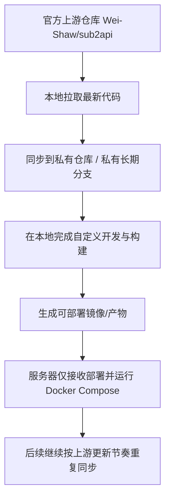

# Sub2API Upstream Sync, Local Build, And Server Deployment Workflow

## Problem Frame
当前目标不是先做新功能，而是先把 `sub2api` 的维护方式切到一条长期可持续的主线：以上游官方仓库为基线，在我们自己的私有仓库和长期分支上做定制开发，本地完成构建，服务器只负责部署。这样后续每次官方更新时，都可以先在本地同步、合并、解决冲突，再把带有我们自定义能力的最新版部署到线上。

当前服务器不适合作为编译环境，因此第一阶段的重点是迁移工作模式和正式切服，而不是继续沿用旧部署方式。旧环境中的现有数据不能直接丢弃，迁移必须以“保留旧数据、切到新模式、之后持续在最新版上开发”为前提。

## Requirements

**Upstream And Repository Model**
- R1. 官方 `Wei-Shaw/sub2api` 仓库必须作为后续长期同步的上游来源。
- R2. 我们必须维护自己的私有 GitHub 仓库，并在其中保留长期自定义分支，用于承载自定义修改，且不以向上游贡献为前提。
- R3. 本地工作流必须支持反复执行“拉取上游最新版 -> 合并到私有分支 -> 解决冲突 -> 重新构建 -> 再部署”的循环。

**Build And Deployment Model**
- R4. 生产可部署镜像或产物必须在本地构建完成，不能依赖服务器进行源码编译。
- R5. 服务器侧的长期标准部署方式定为 `Docker Compose`。
- R6. 服务器部署职责限定为拉取或接收可部署产物、启动/更新容器、做运行态管理，不承担开发和构建职责。
- R7. 第一阶段只有在服务器正式切换到这套新模式后才算完成，不以“本地拉下代码”作为完成标准。

**Migration And Data Preservation**
- R8. 旧服务器中的现有数据必须在迁移中保留，不能默认清空重建。
- R9. 切换到新部署方式前，必须存在明确的数据备份、迁移校验和失败回退路径。
- R10. 旧部署方式可以在新模式稳定运行且数据确认完整后再下线和清理。

**Phase Separation**
- R11. 第一阶段聚焦于升级维护模式、迁移和切服，不在本阶段内实现“视监功能”。
- R12. “视监功能”应在第一阶段完成后，基于更新后的最新版代码单独进行产品定义、界面设计和实现规划。

## Success Criteria
- 私有 GitHub 仓库和长期自定义分支建立完成，并明确以上游官方仓库为同步来源。
- 本地可以基于最新上游代码完成构建，并产出可部署镜像或产物。
- 服务器正式运行在新的 `Docker Compose` 部署模式上。
- 旧环境中的关键数据在切换后仍然可用且经过校验。
- 后续任意一次上游更新，都可以重复执行本地同步、合并、构建、部署这条流程。

## Scope Boundaries
- 本文档不定义“视监功能”的具体页面、指标、排行榜规则或视觉方案。
- 本文档不要求把自定义修改贡献回上游官方仓库。
- 本阶段不把 CI 自动构建设为必选项，默认以本地手动构建为标准方式。
- 本文档不承诺继续沿用旧服务器上的现有部署脚本、容器编排或历史运维方式。

## Key Decisions
- `Docker Compose` 作为服务器长期标准部署方式：比在小服务器上直接编译更稳定，也更适合重复升级。
- 本地手动构建作为第一阶段标准方式：先把迁移主线跑通，再考虑是否引入自动化构建。
- 旧数据保留作为硬约束：迁移目标是替换部署方式，不是重置业务状态。
- 先完成维护/部署主线，再做新功能：这样后续定制开发始终落在最新版代码基线上。

## Dependencies / Assumptions
- 官方上游仓库默认为 `Wei-Shaw/sub2api`，并继续保持可获取的最新版本。
- 官方项目当前支持 `Docker Compose` 部署，这使第一阶段的部署标准具备现实基础。
- 默认把“不能丢的数据”视为至少包括账号、密钥/配置以及对后续运营有价值的历史记录；具体字段范围在规划阶段通过现网审计确认。
- 现有服务器具备运行 Docker 和 Docker Compose 的前提，或可以先补齐该能力。

## Outstanding Questions

### Deferred to Planning
- [Affects R8][Needs research] 盘点现网旧部署的真实数据边界，确认哪些内容实际落在数据库、卷目录、配置文件或外部依赖中。
- [Affects R8][Technical] 设计旧部署到新 `Docker Compose` 部署的实际迁移路径，包括导出、转换、导入和验证步骤。
- [Affects R9][Technical] 定义正式切服前的备份策略、回退触发条件和回退执行步骤。
- [Affects R4][Technical] 确定本地构建后将部署产物送达服务器的具体方式，例如镜像仓库或离线镜像传输。
- [Affects R12][Needs research] 在进入第二阶段前，先审视最新版代码的扩展点和界面风格约束，再展开“视监功能”设计。

## Next Steps
-> /ce:plan for structured implementation planning
