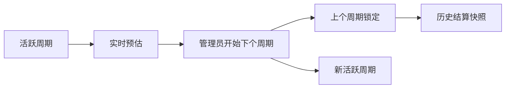

# 结算池计费

## 问题背景

当前产品已经支持余额按量计费和订阅式分组访问。现在需要新增一种更舒服的号池成本分摊模式：参与者无需提前充值或消耗余额即可使用号池，平台负责记录用量，并按周期生成透明、可追溯的结算结果。

这个模式主要面向管理员运营的号池，例如 Codex、Claude Code 和 Claude Max。实际收款在线下完成；产品只负责计算、公开展示和锁定可审计的结算结果。

## 需求

**计费模式与访问**
- R1. 管理员可以把一个分组配置为结算池，结算池应与余额按量计费和订阅计费区分开。
- R2. 被分配到结算池的用户，即使余额为 0，也可以使用该池；该池用量不得扣除用户余额。
- R3. 结算池仍然受正常鉴权、用户状态、分组状态和显式配置的运营控制约束。
- R4. 每个结算池独立结算；Codex、Claude Code 可以使用同一套算法，但成本和参与者不能互相混算。

**管理员配置**
- R5. 管理员可以在分组 UI 中设置结算池参数：基础成本比例、市场封顶价 `l`、阶梯阈值、阶梯权重，以及当前活跃周期的总成本 `C`。
- R6. 阶梯配置支持任意数量的有序阶梯。初始默认值可以是 `0-300 => 1`、`300-1200 => 0.8`、`1200+ => 0.64`。
- R7. 管理员可以为结算池添加和移除参与者。是否参与决定是否承担固定基础分摊，不取决于实际是否使用。
- R8. 在结算锁定前，活跃周期的参数和当前总成本可以编辑；编辑后应实时更新参与者看到的预估结果。

**周期生命周期**
- R9. 每个结算池最多只有一个活跃周期。
- R10. 管理员可以通过一个操作开始新周期。开始新周期时，系统关闭并锁定上一个活跃周期，然后开启下一个周期。
- R11. 每个周期记录开始时间和锁定时间，用于把用量归属到正确的周期窗口。
- R12. 已锁定周期保存结算快照：参与者、参数、用量总计、折算后用量、计算后的应付金额、封顶影响和管理员承担的亏损。
- R13. 已锁定周期的快照对参与者不可变；后续用量、成本、市场封顶价或阶梯设置变化，不得影响历史快照。

**计算规则**
- R14. 进入阶梯算法的原始用量，采用该结算池在该周期内按美元计价的使用额。
- R15. 对于总成本为 `C` 的周期，固定基础池为 `base_ratio * C`，由所有参与者平均分摊。
- R16. 动态用量池为 `(1 - base_ratio) * C`，按照折算后的加权用量分配。
- R17. 参与者的折算用量按阶梯累进计算：每一段原始用量乘以该段配置的阶梯权重。
- R18. 未封顶的动态结算倍率为 `dynamic_pool / total_weighted_usage`。
- R19. 市场封顶价 `l` 只作用于动态结算倍率，不作用于固定基础分摊。
- R20. 参与者的动态费用为 `min(uncapped_dynamic_rate, l) * participant_weighted_usage`。
- R21. 参与者总应付为 `fixed_base_share + dynamic_charge`。
- R22. 如果动态结算倍率超过 `l`，未能回收的动态池金额展示为管理员承担的亏损。
- R23. 如果一个周期内没有任何折算用量，则不分配动态用量费用，动态池全部记为管理员承担的亏损。

**参与者透明度**
- R24. 参与者可以查看自己参与的结算池在活跃周期内的实时结算预估。
- R25. 活跃周期页面展示当前号池成本、封顶价、阶梯表、参与者列表、每个参与者的原始用量、折算用量、预估固定分摊、预估动态费用、预估总应付，以及预估管理员承担亏损。
- R26. 参与者可以清楚看到自己的阶梯位置、折算用量、当前有效动态倍率、固定/动态费用拆分和预估应付金额。
- R27. 参与者可以查看自己参与过的已锁定历史周期。
- R28. UI 应保持简洁、偏运营工具风格：使用紧凑标签、表格和必要的 tooltip，不在页面里写大段说明或实现注释。

**线下结算**
- R29. 本阶段产品不处理结算池费用的在线支付。
- R30. 产品可以提供结算状态标签供管理员追踪，但转账、收款、凭证和财务核对在线下完成。

## 成功标准

- 管理员无需手动用表格计算，即可通过配置参数、分配参与者、更新活跃周期成本、开始下个周期来运营一个结算池。
- 参与者在结算前可以看到实时且可理解的预估，结算后可以看到不再变化的历史快照。
- 用户余额不再阻碍结算池用户使用服务。
- 当市场封顶价导致成本无法完全回收时，系统明确展示管理员承担的亏损。
- UI 在提供必要控制和透明度的同时，不把产品变成长篇计费说明页面。

## 范围边界

- 本阶段不做结算池的预充值或在线收款。
- 不做银行、Stripe、加密货币或发票类自动收款流程。
- 不允许回溯修改已锁定周期快照。
- 不在 Codex、Claude Code、Claude Max 或未来其他池之间做跨池平衡。
- 不公开 API Key、账号凭据、请求内容或其他敏感运营数据。

## 关键决策

- 使用第三种分组计费模式：这样可以把结算池行为与余额扣费、订阅额度语义分开。
- MVP 采用管理员管理参与者名单：这样可以避免“谁需要承担固定基础分摊”的歧义。
- 在开始新周期时锁定上一周期：这让管理员的常用操作足够简单，也给参与者稳定的历史数据。
- 锁定前展示实时预估：这支持公开透明的运营方式，同时不要求系统处理在线支付。
- 市场封顶价只作用于动态部分：固定基础分摊属于占坑成本，刻意不参与封顶计算。

## 依赖与假设

- 现有 usage 记录应足以作为原始用量来源，但计划阶段需要确认哪个成本字段最适合作为结算池的原始用量口径。
- “公开展示”在本文档中指对管理员和该结算池的已认证参与者可见。如果真实意图是所有登录用户都可见，实施前需要明确修改。
- API Key 配额和速率限制可以继续作为显式运营控制保留，但结算池默认行为不应依赖用户余额。

## 待确认问题

### 计划前必须解决
- 无。

### 延后到计划阶段
- [影响 R2][技术] 决定具体的计费类型表示方式，以及它如何在保留显式运营控制的同时绕过余额扣费。
- [影响 R12][技术] 决定活跃周期预估是每次从 usage logs 实时计算，还是为了性能做缓存/聚合。
- [影响 R14][技术] 决定 Codex、Claude Code 和 Claude Max 结算池分别使用哪个原始用量字段。
- [影响 R30][技术] 决定第一版是否包含线下付款状态，还是延后实现。

## 下一步

-> /ce:plan 进行结构化实现计划
