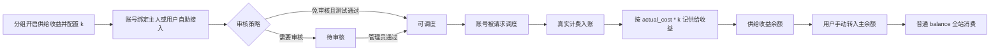

# 资源供给收益 Credit

## Problem Frame

当前产品已经支持用户余额消费、订阅分组和结算池周期结算，但可调度账号主要仍由平台或管理员集中维护。新的目标是让账号资源本身可以成为用户贡献的资产：当某个账号被调度处理请求时，账号主人按该请求产生的用户侧实际消费获得供给收益 credit。

这个能力要同时支持管理员代运营和用户自助接入。管理员始终可以把账号绑定给资源主人；用户自助接入由全站设置控制，默认关闭。收益先进入独立的供给收益余额，用户手动转入主余额后即可像普通充值余额一样全站消费。

## Requirements

**功能开关与分组配置**
- R1. 系统必须提供全站“用户自助接入资源账号”开关，默认关闭；关闭时用户侧不提供自助接入口，但管理员仍可代运营接入账号并绑定账号主人。
- R2. 每个分组必须可以独立开启或关闭供给收益；只有开启供给收益的分组才会为被调度账号产生账号主人收益。
- R3. 每个开启供给收益的分组必须配置收益倍率 `k`，默认值为 `1`；`k` 由分组决定，不由账号或用户个人决定。
- R4. 每个分组必须可以配置用户自助接入后的审核策略：需要管理员审核，或测试成功后自动上线。
- R5. 分组的供给收益开关和 `k` 不改变该分组对调用用户的原有计费方式、价格倍率、订阅限额或结算池规则。

**账号接入与状态**
- R6. 管理员必须可以为可供给账号绑定、变更或清除一个账号主人；一个账号同一时间最多只有一个账号主人。
- R7. 第一版用户自助接入只支持 OpenAI OAuth 和 OpenAI API Key 两种账号类型。
- R8. 当全站自助接入开启，且目标分组允许供给收益并支持 OpenAI 账号调度时，用户可以为该分组提交支持的 OpenAI 账号。
- R9. 自助接入账号采用状态流：草稿/测试中、待审核、可调度、暂停、拒绝。
- R10. 如果分组配置为需要审核，自助账号测试通过后进入待审核，管理员通过后才可调度；如果分组配置为免审核，自助账号测试通过后可以直接进入可调度。
- R11. 管理员必须可以审核通过、拒绝、暂停和恢复自助接入账号，并能给拒绝或暂停留下面向用户可见的简短原因。
- R12. 暂停、拒绝、测试失败或仍在待审核状态的账号不得进入调度，也不得因后续请求产生新的供给收益。
- R13. 自助接入账号的主人必须可以主动暂停或撤回自己提交的账号；暂停或撤回后该账号不得继续进入调度，但历史收益记录保留。
- R14. 自助接入账号的凭据必须按敏感凭据处理：普通用户和非必要页面只展示脱敏元数据，不展示明文 token/API Key；凭据不得出现在普通操作日志、错误提示或收益明细中。

**收益产生规则**
- R15. 一条请求只有在满足以下条件时才产生供给收益：请求成功完成真实计费入账，所在分组开启供给收益，实际被调度账号存在账号主人。
- R16. “真实计费入账”包括余额扣费、订阅用量更新和结算池用量记账；它不要求本次请求一定发生在线收款或主余额扣减。
- R17. 供给收益金额为该请求的用户侧实际计费金额 `actual_cost * k`，其中 `k` 使用请求发生时所属分组的收益倍率。
- R18. 余额计费、订阅计费和结算池计费下的请求都可以产生供给收益，只取决于分组是否开启供给收益。
- R19. 账号主人自己调用自己提供的账号时，也应产生供给收益。
- R20. 同一条请求如果因 request idempotency 或重复计费保护未产生第二次真实入账，则不得产生第二次供给收益。
- R21. `actual_cost <= 0` 的请求不产生正向供给收益。
- R22. 供给收益必须能追溯到来源分组、来源账号、账号主人、调用用户、请求时间和计费金额，但不得向普通用户暴露账号凭据、API Key、请求内容或其他敏感运营数据。

**收益钱包与转入余额**
- R23. 供给收益先进入独立的供给收益余额，不直接写入用户主余额。
- R24. 用户必须可以查看自己的供给收益余额、累计收益、转入主余额记录，以及按时间排序的收益明细。
- R25. 用户必须可以手动把可用供给收益转入主余额。
- R26. 供给收益转入主余额后即成为普通 `balance`，全站通用消费，不按来源分组限制使用。
- R27. 供给收益转入主余额必须有可审计流水，避免刷新页面、重试请求或重复提交导致重复转入。
- R28. 管理员必须可以查看供给收益流水，并能在异常场景下做有备注的人工修正。

**管理员与用户可见性**
- R29. 管理员必须能在账号管理或相邻运营页面中看到账号主人、接入来源、账号状态、所属分组、分组 `k`、近期供给收益和待审核账号。
- R30. 用户必须能看到自己提交或归属的账号、每个账号的当前状态、所属分组和收益汇总。
- R31. 用户不能查看其他账号主人的账号凭据、收益钱包或敏感调度信息。
- R32. 用户侧页面应保持运营工具风格：紧凑表格、状态标签、必要的操作按钮和少量 tooltip，不用长篇说明解释内部计费实现。

## Success Criteria

- 管理员可以在不开放用户自助接入的情况下，先把现有或新账号绑定给主人并产生供给收益。
- 全站开启自助接入后，用户可以提交 OpenAI OAuth 或 OpenAI API Key 账号，并按分组审核策略进入待审核或可调度状态。
- 开启供给收益的任意分组，无论是余额计费、订阅计费还是结算池计费，都能按同一套规则给账号主人记收益。
- 收益金额与用户侧账单心智一致：以 `actual_cost` 为基准，乘以请求发生时分组配置的 `k`。
- 供给收益不会因为重复请求、重复提交或重试而重复入账。
- 用户可以清楚看到供给收益并手动转入主余额，转入后可像普通充值余额一样消费。
- 账号凭据和敏感请求信息不会因为收益透明度而泄露给普通用户。

## Scope Boundaries

- 第一版不做现金提现、银行卡、Stripe、USDT、发票或对外资金结算；收益只转为站内 credit。
- 第一版用户自助接入只支持 OpenAI OAuth 和 OpenAI API Key，不开放 Anthropic、Gemini、Antigravity、Bedrock 或其他账号类型的用户自助接入。
- 第一版不引入按来源分组限制消费的余额；转入主余额后就是全站通用 `balance`。
- 第一版不改变调用用户的原有计费价格，也不改变结算池周期算法；供给收益是分组显式开启后的额外资源补偿规则。
- 第一版不允许普通用户查看其他账号主人的收益明细、账号凭据或请求内容。
- 第一版不默认开启用户自助接入。

## Key Decisions

- 使用 `actual_cost` 作为收益基准：这与用户实际消费账单一致，也能自然继承分组倍率和用户专属倍率。
- `k` 放在分组上：收益政策通常由池子或分组运营决定，而不是由单个账号主人自由设置。
- 用户自助接入采用全站开关 + 分组审核策略：全站开关控制产品入口风险，分组策略控制不同池子的运营强度。
- 收益先进独立供给收益余额：这样账务更清楚，也保留未来加入冻结、审核或异常处理的空间。
- 转入后成为普通 `balance`：这满足“credit 可以正常消费、全站使用”的目标，避免引入复杂的钱包分区。
- 账号主人自用也产生收益：产品语义是资源补偿，只要账号贡献了可计价资源，就应按规则获得 credit。
- 供给收益跟随真实计费入账的一次性语义：扣费只发生一次，收益也只发生一次。

## Dependencies / Assumptions

- 现有 `usage_logs` 已记录 `actual_cost`、`account_id`、`user_id`、`group_id` 和 `billing_type`，可以作为收益归因和展示的基础事实来源。
- 现有 `users.balance` 是主余额；充值、兑换、管理员余额调整和邀请返利转入都已经围绕它形成用户心智。
- 现有邀请返利已经有“收益额度 -> 手动转入余额”的相邻产品模式，可作为供给收益钱包的产品参考。
- 现有结算池需求见 `docs/brainstorms/2026-04-25-settlement-pool-billing-requirements.md` 和 `docs/brainstorms/2026-04-28-settlement-pool-cycle-participation-requirements.md`；本需求不修改其中的周期结算算法。

## Outstanding Questions

### Resolve Before Planning

- 无。

### Deferred to Planning

- [Affects R6-R14][Technical] 确认账号主人、自助接入来源、审核状态和调度状态如何与现有账号模型及调度缓存协调。
- [Affects R17-R20][Technical] 确认供给收益应在真实计费入账事务中同步写入，还是通过可靠异步流水消费，并确保与现有 request idempotency 一致。
- [Affects R17][Technical] 确认分组 `k` 的历史快照保存方式，避免管理员修改 `k` 后影响既有收益流水。
- [Affects R23-R28][Technical] 确认供给收益钱包、转入主余额和人工修正如何与现有余额历史、邀请返利流水、低余额通知和总充值统计相互呈现。
- [Affects R7-R14][Technical] 确认 OpenAI OAuth/API Key 自助接入的测试请求、失败原因、凭据加密和敏感信息脱敏策略。
- [Affects R29-R32][Design] 规划管理员审核列表、用户账号列表、收益明细和转入操作的页面归属，避免新增页面过多或信息分散。

## Next Steps

-> /ce:plan for structured implementation planning
