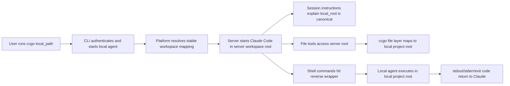

# ccgo Reverse Claude Workstation

## Problem Frame

`ccgo` should let a user run Claude Code through the platform without installing or authenticating Claude Code on every local machine, while preserving the developer's local machine as the source of truth for project files and command execution.

The target experience is:

```bash
ccgo login
ccgo .
```

After that, Claude Code runs in the platform's managed server environment, but the project behaves like the user's local workstation. File reads and edits target the user's local project. Bash, git, npm, Docker, tests, and other commands execute on the user's machine. The server path needed to start Claude Code is an internal implementation detail, not the product truth shown to the user or treated as canonical by Claude.

## Requirements

**CLI and Authentication**
- R1. Users must be able to authenticate with `ccgo login` through the platform's web login flow or with `ccgo login <token>` for token-based setup.
- R2. After login, `ccgo <local_path>` must start or resume a Claude Code workstation for the selected local project without requiring the user to manually configure SSH, tunnels, mounts, or server-side Claude commands.
- R3. `ccgo .` must resolve the current directory to a canonical local project path before creating or reusing a workspace mapping.
- R4. The CLI must provide clear `status` and `stop` commands so users can inspect or end local agent connections and active workstations.

**Local Agent and Connectivity**
- R5. The productized MVP must not require users to enable or install system `sshd`; `ccgo` must provide its own local agent for file and command capabilities.
- R6. The local agent must connect outbound to the platform, so users do not need a public IP address or inbound firewall rule.
- R7. The local agent must expose only the selected project root and the command execution capability needed for that workstation, not unrestricted access to the user's machine.
- R8. If the local agent disconnects, file operations and command execution must fail explicitly with a visible connection error rather than silently running against server-local files or a stale server copy.

**Workspace Mapping**
- R9. A workspace mapping is defined by one user, one canonical local project root, and one stable server workspace root.
- R10. The same user and canonical local project root must reuse the same server workspace root across repeated `ccgo` launches.
- R11. The server workspace root must not be generated per run or named as a temporary session directory, because Claude Code associates project context and history with the directory it runs in.
- R12. A local project path and a server workspace root must be one-to-one for a given user; one local root must not map to multiple server roots, and one server root must not map to multiple local roots.
- R13. If a local project is moved or renamed, `ccgo` may treat it as a new workspace by default, with explicit migration or rebinding left to a later version.
- R14. The local project root is the canonical workspace. The server workspace root exists only so Claude Code can start in a real directory on the server.

**File Operations**
- R15. Claude Code file tools such as Read, Edit, Write, Glob, and Grep must operate on files under the server workspace root while the authoritative content comes from the mapped local project root.
- R16. File operations must preserve normal project-relative paths, file contents, and edit semantics from the user's perspective.
- R17. The MVP must not allow Claude Code to read or write outside the mapped local project root through the ccgo file layer.
- R18. When file access cannot be served from the local agent, the operation must surface the real failure instead of falling back to a server-side placeholder or fake success.

**Command Execution**
- R19. Claude Code shell commands must be intercepted by a server-side reverse command wrapper and executed on the user's local machine through the local agent.
- R20. Commands must run with their working directory translated from the server workspace root to the canonical local project root.
- R21. Bash, git, package manager, Docker, test, and build commands must observe the user's local environment, not the server environment.
- R22. Command stdout, stderr, and exit code must be returned faithfully to Claude Code.
- R23. The wrapper must not silently execute commands on the server when the local agent is unavailable.
- R24. Interactive commands that require a full TTY may be unsupported in the MVP, but failure or limitation messaging must be explicit.

**Claude Context and Path Semantics**
- R25. `ccgo` must inject session-level Claude instructions explaining that the server workspace root is an internal mount/workspace path and that the mapped local project root is the canonical workspace.
- R26. Session instructions must tell Claude to prefer relative paths for file operations and to use the user's local path when explaining paths to the user.
- R27. Session instructions must not overwrite or permanently modify the user's repository `CLAUDE.md`; project-provided `CLAUDE.md` and equivalent project instructions must still be preserved.
- R28. The tool results must make the local-workstation illusion consistent: command `pwd`, file listings, git output, and edited file paths should all be understandable as referring to the mapped local project rather than an unrelated server directory.
- R29. When local and server paths both appear, `ccgo` must treat the local path as product truth and the server path as implementation detail.
- R30. File operations should use project-relative paths whenever possible. If Claude or command output supplies a local absolute path inside the mapped project, `ccgo` should resolve it through the workspace mapping when technically possible; when a platform-specific absolute path cannot be used directly by Claude Code's built-in file tools, session instructions must steer Claude back to relative paths instead of exposing server paths as the canonical answer.

**Security and Trust Boundaries**
- R31. Login tokens, agent credentials, and tunnel/session credentials must be stored and transmitted as sensitive credentials and must not be written into project files or normal command logs.
- R32. The platform must authorize each local agent connection against the authenticated user and the requested workspace mapping.
- R33. The server must not be able to request arbitrary filesystem access outside the project root through the file layer.
- R34. Command execution must have an auditable request boundary: command text, cwd, timestamps, exit code, and actor/session identifiers should be recordable without logging secrets from stdout, stderr, environment variables, or files.
- R35. Dangerous command approval, deny rules, and richer policy controls are not required for the first productized MVP, but the protocol should not make them impossible to add later.

**User Experience and Lifecycle**
- R36. Starting `ccgo <local_path>` should either attach the user to an existing active workstation for that mapped project or start one if none exists.
- R37. The user should not need to know the server workspace path during normal use.
- R38. Error messages should distinguish login/auth failures, local agent connectivity failures, file mapping failures, and command execution failures.
- R39. The MVP should prioritize macOS and Linux local agents, with Windows support allowed through a native agent or WSL-compatible path handling as a planning decision.



## Success Criteria

- A user can run `ccgo login` and then `ccgo .` from a local project without manually setting up SSH, mounts, or Claude Code on the local machine.
- Re-running `ccgo .` from the same canonical local project reuses the same server workspace root and preserves Claude Code's project-associated context.
- Claude Code file reads, edits, searches, and writes affect the user's local project, with no silent server-local fallback.
- Claude Code commands execute in the user's local environment and return real local stdout, stderr, and exit codes.
- Claude receives clear session context that the local project path is canonical and the server workspace path is internal.
- The product never requires users to enable system `sshd` for the productized MVP.
- Loss of local agent connectivity causes explicit failures rather than fake success or unsafe fallback execution.

## Scope Boundaries

- The MVP does not require a full browser UI for workstation management beyond whatever is needed for login and token/session issuance.
- The MVP does not require dangerous-command approval UI, though the execution protocol should leave room for it.
- The MVP does not require full interactive TTY support for commands such as `vim`, `docker attach`, or interactive scaffolding tools.
- The MVP does not require local project migration/rebinding after a directory is renamed or moved.
- The MVP does not require direct support for arbitrary directories outside the selected project root.
- The MVP does not require Windows-native command translation if planning determines WSL is the safer first Windows path.
- The MVP must not use system `sshd` as the required user-facing setup path.

## Key Decisions

- Productized MVP uses a local agent instead of system `sshd`: this avoids asking users to enable machine-wide remote login and gives ccgo a narrower trust boundary.
- Local project root is canonical: the product promise is "Claude on the server, files and commands on your machine," so server paths must not become user-facing truth.
- Workspace mappings are stable per user and canonical local root: Claude Code binds useful context to a project directory, so per-run temporary server paths would fragment history and memory.
- Server workspace path is still required: Claude Code must start in a real server directory, but that directory is an internal projection of the local project.
- Session-level Claude instructions are required: because Claude Code may see its server startup directory in internal context, ccgo must explicitly tell Claude that the server path is an implementation detail and the local root is canonical.
- Project instructions are preserved: ccgo context should be injected as session context or an overlay, not by modifying the user's repository `CLAUDE.md`.
- Explicit failure beats fallback: running commands or editing stale server files when the local agent is unavailable would break the core trust model.

## Dependencies / Assumptions

- The current repository already has user authentication, token concepts, and Claude Code-related gateway behavior, but no existing `ccgo` workstation product was found in the codebase scan.
- Claude Code supports shell command wrapping through documented environment configuration, and project memory/context can be augmented through Claude instructions; exact startup injection mechanics should be verified during planning.
- The platform server can run Claude Code in a managed environment with per-user workspace isolation.
- The local agent can maintain an outbound authenticated connection suitable for command execution and file access.

## Outstanding Questions

### Resolve Before Planning

- 无。

### Deferred to Planning

- [Affects R15-R18][Technical] Decide whether the first file layer should use FUSE, an embedded protocol mounted on the server, a carefully bounded sync projection, or another mechanism while preserving explicit failure semantics.
- [Affects R19-R24][Technical] Verify the exact Claude Code command interception mechanism and how it interacts with hooks, MCP stdio servers, login shells, and cwd tracking.
- [Affects R25-R30][Technical] Decide the safest startup injection mechanism for ccgo session instructions without modifying user repository files.
- [Affects R31-R35][Security] Define the agent authentication, credential storage, transport encryption, audit redaction, and per-workspace authorization model.
- [Affects R39][Technical/Product] Choose the first supported Windows path: native agent with path mapping, WSL requirement, or Windows deferred.
- [Affects R9-R14][Technical] Define canonical local path normalization across macOS, Linux, and Windows so stable workspace IDs do not collide or drift.

## Next Steps

-> /ce:plan for structured implementation planning
