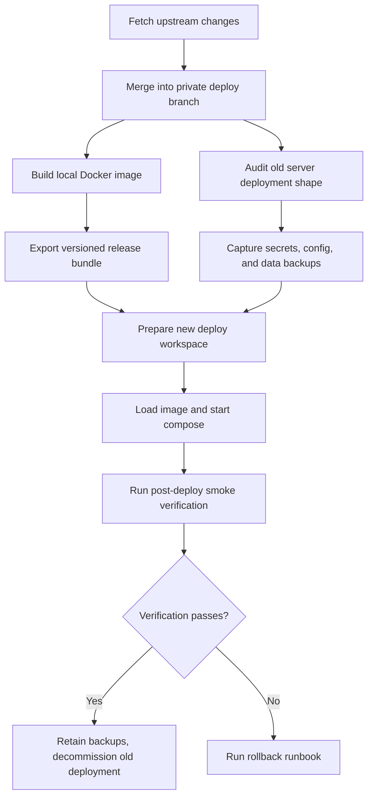
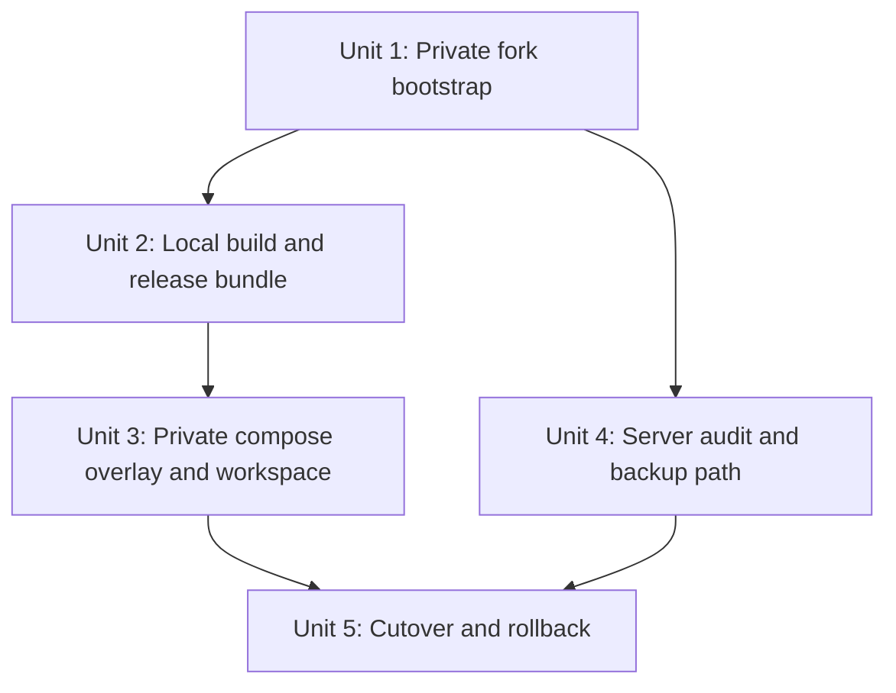

# feat: Establish sub2api private fork local-build and cutover workflow

**Target repo:** private fork seeded from `Wei-Shaw/sub2api`

## Overview

This plan establishes the phase-1 operating model for Sub2API: track the official upstream repo, keep private long-lived customization branches in a private GitHub repo, build deployable images locally, and run production only through Docker Compose on the server. The cutover path treats old-server data preservation and rollback as hard gates, not cleanup tasks after the fact.

The implementation should minimize long-lived drift from upstream by preferring additive overlays, helper scripts, and runbooks over broad edits to core upstream deployment files. That keeps future upstream merges routine while still giving the private fork a stable deployment workflow.

## Problem Frame

The user wants a maintenance model where future custom development always starts from the latest upstream `Wei-Shaw/sub2api`, with custom changes carried in a private fork and deployed only after local build. The server is intentionally treated as a runtime target rather than a build machine, and the first milestone is not “clone the repo” but “finish the migration and formally cut production over” (see origin: `docs/brainstorms/2026-04-17-sub2api-upstream-local-build-deploy-requirements.md`).

The migration is high-risk because the old deployment shape is still unknown: it may be binary/systemd, Docker Compose with local directories, Docker Compose with named volumes, or a mixed/manual state. Existing user data, account pool configuration, login/session continuity, and other production settings must survive the transition. The follow-on “visibility/leaderboard” feature is explicitly deferred until this operating model is in place (see origin: `docs/brainstorms/2026-04-17-sub2api-upstream-local-build-deploy-requirements.md`).

## Requirements Trace

- R1. Keep the official `Wei-Shaw/sub2api` repo as the upstream source of truth.
- R2. Maintain a private GitHub repo and long-lived private customization branch for deployable work.
- R3. Support a repeatable loop of upstream fetch -> merge into the private branch -> local rebuild -> redeploy.
- R4. Build deployable artifacts locally rather than on the production server.
- R5. Standardize production on Docker Compose.
- R6. Limit the server to artifact reception, container startup, and runtime management.
- R7. Define completion as production cutover, not merely repository setup.
- R8. Preserve existing production data through migration.
- R9. Make backups, validation, and rollback part of the migration path.
- R10. Decommission the old deployment only after the new one is validated.
- R11. Keep this phase focused on workflow migration and cutover.
- R12. Defer the visibility feature until the upgraded private fork is stable.

## Scope Boundaries

- No implementation of the visibility / leaderboard / “视监” feature in this phase.
- No expectation that changes from this phase will be contributed upstream.
- No CI-based auto build requirement; local manual build is the baseline.
- No commitment to preserve the old deployment mechanism after the new one is live.

### Deferred to Separate Tasks

- Design and implementation planning for the visibility feature after cutover completes.
- Optional future move from manual image bundle delivery to a registry-based delivery flow.

## Context & Research

### Relevant Code and Patterns

- `deploy/docker-compose.local.yml` uses `./data`, `./postgres_data`, and `./redis_data` and is explicitly documented by upstream as the migration-friendly production option.
- `deploy/docker-deploy.sh` already generates `.env`, `JWT_SECRET`, `TOTP_ENCRYPTION_KEY`, `POSTGRES_PASSWORD`, and the expected local-directory deployment layout.
- `deploy/build_image.sh` and the root `Dockerfile` already define the local Docker image build path, including frontend build and embedded backend packaging.
- `backend/internal/setup/setup.go` shows that Docker `AUTO_SETUP=true` writes `data/config.yaml` and `.installed`, applies `backend/migrations/*.sql`, and intentionally skips admin bootstrap when user data already exists.
- `deploy/README.md` documents forward-only DB migrations, backup expectations, and both local-directory and named-volume Docker flows.
- `deploy/DATAMANAGEMENTD_CN.md` documents the optional host-side `datamanagementd` socket mount at `/tmp/sub2api-datamanagement.sock`, which may need to be preserved during cutover.
- `deploy/sub2api.service` and `deploy/README.md` document the binary-install layout (`/opt/sub2api`, `/etc/sub2api/config.yaml`), which is one likely old-server source mode.

### Institutional Learnings

- No local `docs/solutions/` artifacts were present in the planning repo, so there is no existing institution-specific migration playbook to reuse directly.
- Upstream `DEV_GUIDE.md` confirms the project’s current build posture: Go backend, Vue 3 frontend, `pnpm` for frontend dependencies, and an existing fork-based development model.

### External References

- Official upstream repository and deployment docs in `README.md`, `deploy/README.md`, `deploy/docker-compose.local.yml`, `deploy/docker-deploy.sh`, and `.github/workflows/release.yml`.

## Key Technical Decisions

| Decision | Choice | Rationale |
|---|---|---|
| Base production compose file | Reuse `deploy/docker-compose.local.yml` as the base | Upstream explicitly recommends the local-directory version for backup and migration, which matches the user’s requirement to preserve and move data safely. |
| Private deployment customization strategy | Add private overlay files, scripts, and runbooks instead of broadly patching upstream deploy files | This keeps the long-lived delta small and makes future upstream merges cheaper and less fragile. |
| Artifact delivery baseline | Use a locally built, versioned Docker image bundle (`docker save` transfer + server `docker load`) for phase 1 | It avoids adding private registry infrastructure before the workflow itself is stable. |
| Secret continuity rule | Preserve recovered `JWT_SECRET`, `TOTP_ENCRYPTION_KEY`, DB/Redis credentials, and other production env values whenever they exist | Losing these silently would invalidate sessions, 2FA, or service connectivity and would turn “data preserved” into only a partial truth. |
| Auto-setup interaction with migrated data | Allow Docker auto-setup only after data and secrets are mapped into the new layout | `AUTO_SETUP` is useful for writing `config.yaml` and the install lock, but it should not be allowed to run against an ambiguous or incomplete migration input set. |

## Open Questions

### Resolved During Planning

- Which upstream deployment flavor should production standardize on? `deploy/docker-compose.local.yml`, not `deploy/docker-compose.yml`, because upstream documents it as easier to back up and migrate.
- Should phase 1 depend on a container registry? No. The baseline plan uses locally built image bundles so the migration is not blocked on extra infrastructure.
- Where should private deployment differences live? In additive files such as `deploy/docker-compose.private.yml`, `deploy/private/.env.production.example`, migration scripts, and runbooks rather than large edits to upstream files.
- How should migrated data interact with Docker auto-setup? By mapping secrets and source data first, then letting auto-setup write `config.yaml` / `.installed` and skip admin creation if existing users are already present.

### Deferred to Implementation

- Whether the current production environment is binary/systemd, local-directory Compose, named-volume Compose, or a mixed/manual layout.
- Whether `datamanagementd` is currently deployed and therefore needs a socket mount carried forward.
- Which non-default production env values are actually in use today, including OAuth secrets, URL allowlist settings, update proxy, and any custom ports.
- Whether the old server contains local code patches that must be ported into the private fork before cutover.

## Output Structure

```text
docs/
  operations/
    fork-workflow.md
    local-build-and-release.md
    deployment-layout.md
deploy/
  docker-compose.private.yml
  private/
    .env.production.example
  migration/
    audit_server.sh
    backup_server.sh
    import_strategy.md
    verify_postgres.sql
    verify_runtime_data.sh
  runbooks/
    cutover.md
    rollback.md
  scripts/
    export_release_bundle.sh
    load_release_bundle.sh
    post_deploy_smoke.sh
    preflight_checks.sh
  tests/
    compose_config_smoke.sh
    migration_audit_smoke.sh
    post_deploy_smoke_dryrun.sh
    release_bundle_smoke.sh
```

## High-Level Technical Design

> *This illustrates the intended approach and is directional guidance for review, not implementation specification. The implementing agent should treat it as context, not code to reproduce.*



## Implementation Units



- [ ] **Unit 1: Bootstrap the private fork and upstream-sync workflow**

**Goal:** Establish the private repo structure, branch model, and human-readable sync process so future upstream updates and private deployments follow one documented path.

**Requirements:** R1, R2, R3, R11

**Dependencies:** None

**Files:**
- Modify: `DEV_GUIDE.md`
- Create: `docs/operations/fork-workflow.md`
- Create: `docs/operations/upstream-sync-checklist.md`

**Approach:**
- Seed a private GitHub repo from upstream and document the remote model (`origin` = private repo, `upstream` = official repo).
- Treat one long-lived branch as the deployable private branch; upstream updates merge into that branch before every local build/release cycle.
- Keep phase-1 private changes additive and operational: deployment overlays, migration scripts, and docs belong in the private repo; product behavior changes stay out of this milestone.

**Patterns to follow:**
- `DEV_GUIDE.md`
- `deploy/README.md`

**Test scenarios:**
- Test expectation: none -- this unit produces workflow documentation and repository conventions rather than runtime behavior.

**Verification:**
- A new contributor can clone the private repo, understand the branch/remotes model from repo docs, and follow the upstream-sync loop without guessing.
- The private repo has a documented place for operational customizations before any production cutover work begins.

- [ ] **Unit 2: Standardize local image build and release bundle creation**

**Goal:** Turn the upstream Docker build path into a repeatable local release artifact that can be shipped to the server without building there.

**Requirements:** R3, R4, R6, R7

**Dependencies:** Unit 1

**Files:**
- Modify: `deploy/build_image.sh`
- Create: `deploy/scripts/export_release_bundle.sh`
- Create: `deploy/scripts/load_release_bundle.sh`
- Create: `deploy/tests/release_bundle_smoke.sh`
- Create: `docs/operations/local-build-and-release.md`

**Approach:**
- Reuse the existing root `Dockerfile` and `deploy/build_image.sh` instead of inventing a parallel build path.
- Extend the local build flow so it accepts an explicit private image name/tag and emits a versioned release bundle containing the image archive plus a small manifest (version, checksum, build date, expected compose override inputs).
- Keep the bundle secret-free: `.env` values and recovered production secrets stay outside the artifact and are injected separately on the server.

**Patterns to follow:**
- `deploy/build_image.sh`
- `Dockerfile`
- `.github/workflows/release.yml`

**Test scenarios:**
- Happy path: a tagged local build produces a private image and the export script emits a bundle whose manifest references the same image tag.
- Edge case: rebuilding the same version updates or replaces the release bundle deterministically without mutating application source files.
- Error path: attempting export with no built image or no release tag fails before creating a partial bundle.
- Integration: loading the exported image on a clean Docker host restores the expected image tag and metadata from the manifest.

**Verification:**
- An operator can produce a deployable release bundle from a local machine without needing Go or Node on the server.
- The release bundle can be transferred independently of repo secrets and still be sufficient for server-side image loading.

- [ ] **Unit 3: Add the private compose overlay and production workspace layout**

**Goal:** Define the server-side deployment workspace and Compose invocation in a way that stays close to upstream while allowing private image and host-specific overrides.

**Requirements:** R4, R5, R6, R7, R10

**Dependencies:** Unit 2

**Files:**
- Create: `deploy/docker-compose.private.yml`
- Create: `deploy/private/.env.production.example`
- Create: `docs/operations/deployment-layout.md`
- Create: `deploy/tests/compose_config_smoke.sh`

**Approach:**
- Keep `deploy/docker-compose.local.yml` as the canonical upstream base and layer private changes in `deploy/docker-compose.private.yml`.
- Use the override only for the private image reference and genuinely local concerns such as optional socket mounts, host-specific ports, or production-only labels.
- Standardize the deploy workspace to the layout upstream already expects: compose files plus `.env`, `data/`, `postgres_data/`, and `redis_data/`.
- Document which values must be carried forward from the old deployment before first boot, especially `JWT_SECRET`, `TOTP_ENCRYPTION_KEY`, DB/Redis credentials, admin email, OAuth secrets, proxy settings, and any URL allowlist configuration.
- Make the merged two-file Compose invocation the only documented production path so operators do not drift back to editing upstream base files or running the wrong compose target during future upgrades.

**Patterns to follow:**
- `deploy/docker-compose.local.yml`
- `deploy/.env.example`
- `deploy/docker-deploy.sh`
- `deploy/DATAMANAGEMENTD_CN.md`

**Test scenarios:**
- Happy path: rendering the base compose file plus the private override yields a valid config with the private image and local-directory data mounts intact.
- Edge case: omitting optional host integrations such as the `datamanagementd` socket still yields a valid merged compose config.
- Error path: missing required env values such as `POSTGRES_PASSWORD` or the private image tag fail preflight before deployment begins.
- Integration: the merged config still points app runtime data at `/app/data` and preserves the local-directory persistence model for PostgreSQL and Redis.

**Verification:**
- The server deployment can be stood up from tracked repo files plus secrets, without hand-editing upstream Compose files at deploy time.
- Future upstream Compose updates remain easy to diff because private changes live in the overlay.

- [ ] **Unit 4: Audit the old server, capture backups, and define the import strategy**

**Goal:** Discover the real production source mode, preserve everything needed for continuity, and remove guesswork from the migration input set.

**Requirements:** R8, R9, R10

**Dependencies:** Unit 1

**Files:**
- Create: `deploy/migration/audit_server.sh`
- Create: `deploy/migration/backup_server.sh`
- Create: `deploy/migration/import_strategy.md`
- Create: `deploy/migration/verify_postgres.sql`
- Create: `deploy/migration/verify_runtime_data.sh`
- Create: `deploy/tests/migration_audit_smoke.sh`

**Approach:**
- Detect the source mode deliberately rather than inferring from one signal: inspect for binary-install paths (`/opt/sub2api`, `/etc/sub2api/config.yaml`, systemd service), local-directory Docker deploys, named-volume Docker deploys, and mixed/manual leftovers.
- Capture secrets and config as first-class migration data, not afterthoughts: DB/Redis connection values, JWT/TOTP secrets, admin email, OAuth secrets, update proxy, allowlist/security settings, and any deployment-specific config files.
- Produce immutable backups for database state, Redis state, runtime `data/`, and deployment descriptors before any destructive action.
- Map the detected source mode to an explicit import path: direct directory copy for local-directory deploys, config translation for binary installs, or data export/import for named-volume installs.
- Treat unrecoverable session/2FA secrets as a cutover blocker that requires an explicit user decision, not a silent fallback to regenerated values.

**Patterns to follow:**
- `deploy/README.md`
- `deploy/sub2api.service`
- `deploy/DATAMANAGEMENTD_CN.md`
- `backend/internal/setup/setup.go`

**Test scenarios:**
- Happy path: the audit script classifies a fixture deployment correctly as binary install, local-directory Compose, or named-volume Compose and emits the required artifact list.
- Edge case: a mixed state (for example, old systemd files plus dormant Docker artifacts) is marked ambiguous instead of being guessed into one source mode.
- Error path: missing readable env/config/volume sources stop the audit with an actionable gap report before any backup or cutover step proceeds.
- Integration: the backup manifest covers DB state, Redis/runtime state, secrets/config capture, and checksum evidence aligned with the selected import strategy.

**Verification:**
- Before cutover, there is a complete backup set and a source-mode-specific import checklist.
- The migration no longer depends on remembering how the old server was set up.

- [ ] **Unit 5: Execute cutover, smoke verification, and rollback readiness**

**Goal:** Turn the audited source deployment into the new Compose-based production runtime with preserved data, observable validation, and a safe exit path if anything fails.

**Requirements:** R5, R6, R7, R8, R9, R10

**Dependencies:** Unit 2, Unit 3, Unit 4

**Files:**
- Create: `deploy/runbooks/cutover.md`
- Create: `deploy/runbooks/rollback.md`
- Create: `deploy/scripts/preflight_checks.sh`
- Create: `deploy/scripts/post_deploy_smoke.sh`
- Create: `deploy/tests/post_deploy_smoke_dryrun.sh`

**Approach:**
- Run cutover as a disciplined sequence: final upstream sync and local build, final production backup, transfer the release bundle, prepare the new workspace, load the image, start the merged Compose stack, verify preserved behavior, and only then retire the old deployment.
- Preflight checks must cover server disk headroom, Docker/Compose availability, env completeness, bundle checksum, and presence of the required backup artifacts.
- Branch cutover behavior by source mode: local-directory deploys should copy `data/`, `postgres_data/`, and `redis_data/` only after the final backup is frozen; binary or named-volume deploys should restore DB/runtime data into the target layout before the first compose boot so `AUTO_SETUP` sees migrated state rather than an empty system.
- Smoke verification should validate both platform health and business continuity: health endpoint, admin login, existing user presence, retained API keys, representative upstream account routing, and evidence that usage/account data is still visible after cutover.
- Rollback should restore the last known-good deployment/data state if health checks fail, preserved data is incomplete, or representative traffic does not work as expected.

**Patterns to follow:**
- `deploy/README.md`
- `deploy/docker-entrypoint.sh`
- `backend/internal/setup/setup.go`

**Test scenarios:**
- Happy path: preflight passes, the new Compose stack becomes healthy, and preserved user/account data remains accessible after cutover.
- Edge case: existing users cause admin bootstrap to be skipped during auto-setup, but preserved credentials still allow successful admin access afterward.
- Error path: failed health check, missing preserved data, or failed representative API traffic triggers rollback criteria before the old deployment is deleted.
- Integration: post-deploy smoke verification exercises the full runtime path across Compose app container, PostgreSQL, Redis, and optional host integrations such as `datamanagementd`.

**Verification:**
- Production is running under the new Compose-based workflow with preserved data and documented recovery steps.
- The old deployment is only removed after the new runtime passes smoke verification and backup validation.

## System-Wide Impact

- **Interaction graph:** Git remotes -> private fork -> local Docker build -> release bundle transfer -> server Compose runtime -> PostgreSQL/Redis persistence -> optional host `datamanagementd` integration.
- **Error propagation:** Missing or mismatched secrets surface as login/session/TOTP failures; incomplete data import surfaces as missing users/accounts/API keys; bad release bundles or override config should fail before runtime mutation.
- **State lifecycle risks:** Partial cutover can fork the source of truth; regenerated JWT/TOTP secrets would preserve tables but still break user continuity; named-volume exports and copied local directories have different failure modes and must not be conflated.
- **API surface parity:** Public API endpoints, existing API keys, and admin/user UI behavior should remain upstream-compatible in phase 1; this plan changes how the system is built and deployed, not what product behavior users see.
- **Integration coverage:** Unit-level scripts are not enough on their own; the cutover path must exercise the real app + DB + Redis stack and any retained host-side data-management socket.
- **Unchanged invariants:** Upstream routing, billing, and account-management semantics stay governed by upstream Sub2API behavior in this phase. The visibility feature remains out of scope until after cutover.

## Risks & Dependencies

| Risk | Mitigation |
|------|------------|
| Current production source mode is misidentified | Require explicit audit output and a source-mode-specific import strategy before cutover. |
| Sessions or 2FA break because secrets were regenerated | Recover and carry forward `JWT_SECRET` and `TOTP_ENCRYPTION_KEY`; treat missing values as a cutover blocker that requires an explicit decision. |
| Future upstream merges become painful because private deployment changes sprawl across core files | Keep private changes additive where possible: overlay compose, helper scripts, and runbooks instead of broad edits to upstream deployment assets. |
| Server lacks space or tooling to receive the release bundle safely | Add preflight checks for disk headroom, Docker/Compose presence, and image/bundle checksum validation before stopping the old deployment. |
| The new stack boots before migrated data is in place and `AUTO_SETUP` initializes against an empty target | Gate the first `docker compose up` on completed import/copy steps and explicit presence checks for the source-mode-specific data set. |
| Rollback is theoretically documented but practically incomplete | Require backup manifest verification and a tested rollback runbook before deleting the old deployment. |
| Optional host-side integrations such as `datamanagementd` are forgotten during cutover | Make source-mode audit capture host-side sockets/services and keep them in the compose override or explicit cutover checklist. |

## Documentation / Operational Notes

- Keep server-only secrets out of tracked files; examples belong in `deploy/private/.env.production.example`, while real values stay in the server `.env`.
- Tag each locally built release bundle with a human-meaningful version tied back to the private fork state used for the build.
- Record the final production deployment directory and last successful backup set in the cutover runbook once the first migration lands.
- When phase 1 is complete, phase 2 planning for the visibility feature should start from the upgraded private fork rather than from the old production environment.

## Sources & References

- **Origin document:** `docs/brainstorms/2026-04-17-sub2api-upstream-local-build-deploy-requirements.md`
- Related code and docs:
  - `DEV_GUIDE.md`
  - `Dockerfile`
  - `.github/workflows/release.yml`
  - `backend/internal/setup/setup.go`
  - `backend/migrations/`
  - `deploy/.env.example`
  - `deploy/build_image.sh`
  - `deploy/docker-compose.local.yml`
  - `deploy/docker-deploy.sh`
  - `deploy/docker-entrypoint.sh`
  - `deploy/README.md`
  - `deploy/DATAMANAGEMENTD_CN.md`
  - `deploy/sub2api.service`
