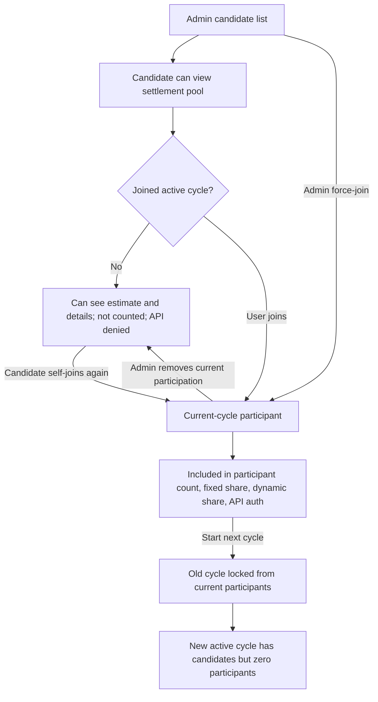
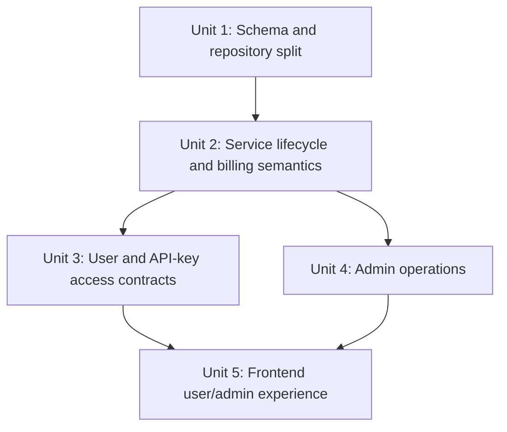

# feat: Add settlement pool per-cycle participation

## Overview

This plan splits settlement pool access into two explicit concepts: long-term candidate eligibility and current-cycle participation. Admins decide who is eligible to see and join a settlement pool; eligible users must actively join each new cycle before their API key can use the pool or before they are counted in billing.

The key implementation move is to stop treating `settlement_pool_participants` as both permission and billing membership. The new model should keep candidate eligibility across cycles, store participation per cycle, and remove the earlier self-exit behavior entirely.

## Problem Frame

The settlement pool billing feature was originally built around one participant list. That list made sense when participation was effectively stable across cycles, but the new product rule is different: a user may be eligible to join a pool without having committed to the current cycle's fixed seat cost (see origin: `docs/brainstorms/2026-04-28-settlement-pool-cycle-participation-requirements.md`).

The user-facing rule should stay simple: candidate users can see pool details and estimates, click once to join the current cycle, and cannot self-exit afterward. Admins keep private operational powers to manage eligibility, force-join users, and remove users from the current cycle without exposing "contact admin" instructions in the user UI.

## Requirements Trace

- R1. Admins maintain a long-term candidate list per settlement pool; only candidates can see and self-join that pool.
- R2. Adding a candidate grants eligibility only; it does not join the current cycle by default.
- R3. Admins can perform a backend compound action that adds candidate eligibility and current-cycle participation together.
- R4. New cycles retain candidates but start with zero current-cycle participants.
- R5. Joining the current cycle means full-cycle fixed seat responsibility, with no time proration.
- R6. Users cannot self-exit after joining; previous unused self-exit logic and UI must be removed.
- R7. Candidate-only API key usage must be rejected and must not auto-join the user.
- R8. Candidate-only users are not counted in participant count, fixed share, dynamic share, or billing estimates.
- R9. Candidate-only users can still see the pool name, current-cycle parameters, participant details, live estimate, and their own historical cycles.
- R10. Non-candidates cannot see the pool or self-join the current cycle.
- R11. Admins can force-join candidate users into the current cycle.
- R12. Admins can remove current-cycle participants unconditionally, even after usage exists.
- R13. Removing a current-cycle participant does not remove long-term candidate eligibility.
- R14. Removed users can self-join again in the same cycle if they remain candidates.
- R15. A removed user who does not rejoin is excluded from the locked settlement snapshot, including their usage details.
- R16. A removed user who rejoins is counted as a participant again, and their full-cycle usage is included.

## Scope Boundaries

- Do not change the tier weighting algorithm, market cap behavior, fixed pool calculation, dynamic pool calculation, or locked snapshot format except where participant eligibility changes which users are included.
- Do not add payment collection, invoices, receipts, or fund-flow features.
- Do not expose "ask admin to add/remove me" copy or flows in user-facing UI.
- Do not mutate already locked historical snapshots.
- Do not let non-candidates see settlement pools through user APIs or frontend routes.

## Context & Research

### Relevant Code and Patterns

- `backend/migrations/133_settlement_pool_billing.sql` currently creates `settlement_pool_configs`, `settlement_pool_cycles`, and `settlement_pool_participants`. The last table now needs to become candidate eligibility, while a new cycle-scoped table carries billing participation.
- `backend/internal/service/settlement_pool.go` owns the settlement pool domain model, estimate calculation, current-cycle rotation, and user/admin summaries.
- `backend/internal/repository/settlement_pool_repo.go` owns SQL for participants, cycle snapshots, usage aggregation, and current admin participant sync. It also mirrors settlement pool participants into `user_allowed_groups`.
- `backend/internal/handler/settlement_pool_handler.go` and `backend/internal/server/routes/user.go` expose user settlement pool endpoints. The dirty worktree currently contains an earlier `ExitActiveCycle` route that should be deleted, not adapted.
- `backend/internal/handler/admin/settlement_pool_handler.go` and `backend/internal/server/routes/admin.go` expose admin config, participant sync, and cycle rotation endpoints. These need explicit candidate/current-cycle operations.
- `backend/internal/service/api_key_service.go`, `backend/internal/server/middleware/api_key_auth.go`, and `backend/internal/server/middleware/api_key_auth_google.go` gate API key binding and runtime API access for settlement pool groups.
- `frontend/src/views/user/SettlementPoolsView.vue`, `frontend/src/views/admin/SettlementPoolsView.vue`, `frontend/src/api/settlementPools.ts`, `frontend/src/api/admin/settlementPools.ts`, `frontend/src/types/index.ts`, and locale files already contain settlement pool UI/API contracts to extend.
- Existing tests include `backend/internal/service/settlement_pool_test.go`, `backend/internal/repository/settlement_pool_repo_test.go`, `backend/internal/service/api_key_service_settlement_test.go`, middleware tests, and frontend settlement pool view specs.

### Institutional Learnings

- No local `docs/solutions/` files were present, so there is no prior internal settlement-pool migration note to reuse.

### External References

- No external research is needed for this plan. The work is governed by local billing semantics, repository migrations, and existing Go/Vue patterns.

## Key Technical Decisions

| Decision | Choice | Rationale |
|---|---|---|
| Eligibility model | Rename/recast the existing participant concept as long-term candidates | The existing table already represents group-level access and can be backfilled safely into candidate eligibility. Clear candidate naming avoids future billing mistakes. |
| Current-cycle model | Add cycle-scoped participation rows keyed by cycle and user | Billing, API usage, removal, rejoin, and new-cycle reset all need membership attached to a specific cycle. |
| New cycle behavior | Rotate cycles without copying current participants into the new active cycle | This directly satisfies the explicit manual join rule for every cycle. |
| User join semantics | User `POST` joins the active cycle only if candidate eligibility already exists | Candidate eligibility remains admin-controlled; joining is the user's explicit billing commitment. |
| Admin force-join semantics | Admin force-join can ensure candidate eligibility and current participation in one transaction | This supports private operational handling without adding user-facing admin-contact UI. |
| Removal semantics | Admin current-cycle removal deletes only the cycle participation row | The user remains a candidate and may rejoin; if they do not, estimates and locked snapshots exclude them. |
| Usage window after rejoin | Current membership is a yes/no gate; usage aggregation still covers the full cycle window | This preserves existing cycle-level billing logic and satisfies the "rejoin counts whole-cycle usage" rule. |
| API key policy | Candidate-only users cannot bind/use settlement pool API keys; current-cycle participation is required for API key group availability and runtime auth | This keeps API behavior aligned with the explicit join commitment and avoids creating keys that look usable but are denied. |
| Self-exit | Delete user self-exit routes, service methods, response fields, tests, and UI | The product decision removed voluntary exit entirely. |

## Alternative Approaches Considered

- Reuse one table with flags: rejected because candidate eligibility and current-cycle billing participation have different lifecycles, especially on cycle rotation and admin removal.
- Keep the physical `settlement_pool_participants` table name for candidates: rejected despite lower migration churn because the old name would keep inviting billing and visibility bugs.
- Auto-join on first settlement pool API request: rejected because the origin explicitly requires a page-level join action before use.
- Allow candidate-only API key binding but reject only runtime usage: rejected for this iteration because it creates keys that appear valid but cannot work until another UI action happens.
- Track join/remove time segments for proration: rejected because the origin explicitly says fixed seat cost is not prorated and rejoin counts whole-cycle usage.

## Open Questions

### Resolved During Planning

- How should the two product concepts be represented? Use long-term candidates plus cycle-scoped participants, not a single list with flags.
- Should a new cycle inherit old participants? No. It should retain candidates only and start with no current-cycle participants.
- How should admin remove/rejoin affect usage? Removal excludes the user only while they are absent from current-cycle participants; rejoin includes their whole-cycle usage because aggregation remains cycle-window based.
- What error should candidate-only API key usage return? Keep the existing 403 settlement-pool-participation failure shape and update text to point at joining the current cycle rather than being in a generic participant list.
- What happens if admin removes long-term candidate eligibility for a current participant? Treat eligibility removal as a stronger revoke that also removes active current-cycle participation; use current-cycle removal when the admin wants only a temporary billing exclusion.

### Deferred to Implementation

- Exact migration file number if another migration lands before implementation; otherwise use the next migration after `backend/migrations/133_settlement_pool_billing.sql`.
- Exact DTO and method names after fitting existing handler/service naming conventions.
- Final admin page layout details after adapting the existing table and `UserSearchCombobox` flow.

## High-Level Technical Design

> *This illustrates the intended approach and is directional guidance for review, not implementation specification. The implementing agent should treat it as context, not code to reproduce.*

## Implementation Units

- [x] **Unit 1: Split candidate eligibility from cycle participation in storage**

**Goal:** Make the database and repository layer capable of representing long-term candidates separately from current-cycle participants, including migration/backfill from the existing participant list.

**Requirements:** R1, R2, R4, R8, R11, R12, R13, R15, R16

**Dependencies:** None

**Files:**
- Create: `backend/migrations/134_settlement_pool_cycle_participation.sql`
- Modify: `backend/internal/repository/settlement_pool_repo.go`
- Test: `backend/internal/repository/settlement_pool_repo_test.go`
- Test: `backend/internal/repository/migrations_schema_integration_test.go`

**Approach:**
- Add a forward migration that renames/converts the existing group/user participant list into long-term candidate eligibility, using a clear physical table name such as `settlement_pool_candidates`. Preserve and rename indexes/constraints deliberately.
- Add a cycle-scoped participation table, for example `settlement_pool_cycle_participants`, with enough columns to query by cycle, group, user, and join time. `joined_at` is audit metadata only; it must not drive prorated billing.
- Backfill the active cycle participation table from existing participants for each group's current active cycle so current users do not lose access during deployment.
- Make migration failures explicit. If a group has candidate rows but no active cycle to backfill, the migration or repository initialization path should surface that state rather than silently inventing participation rows.
- Keep locked historical snapshots untouched. User history should come from existing locked snapshots, not from rewriting old cycles.
- Replace repository methods that currently imply one participant list with explicit candidate and current-cycle methods: list/sync candidates, check candidate, list cycle participants, join active cycle, remove active-cycle participant, and list current participant group IDs for API key access.
- Keep candidate synchronization with `user_allowed_groups` for settlement pool groups, because candidate eligibility is still group-level visibility permission.

**Execution note:** Start with repository/migration characterization tests around the old participant table behavior before changing SQL names, because this is a persistent data migration.

**Patterns to follow:**
- `backend/migrations/133_settlement_pool_billing.sql`
- `backend/internal/repository/settlement_pool_repo.go`
- `backend/internal/repository/migrations_schema_integration_test.go`
- Existing repository transaction style in `SyncParticipants`

**Test scenarios:**
- Happy path: existing `settlement_pool_participants` rows migrate into candidate eligibility and active-cycle participation rows for the current active cycle.
- Happy path: syncing candidates adds/removes candidate rows and mirrors the settlement pool group in `user_allowed_groups`.
- Edge case: a settlement pool with candidates but no active cycle can still create or ensure an active cycle before user/admin join.
- Edge case: a group with no candidates returns empty current participants and an estimate with participant count `0`.
- Error path: syncing candidates with a deleted or missing user fails without partially mutating candidate or `user_allowed_groups` rows.
- Integration: removing current-cycle participation leaves candidate eligibility intact and does not delete locked historical snapshots.
- Integration: after current-cycle removal and rejoin, one current-cycle row exists and usage aggregation over the full cycle window includes that user again.

**Verification:**
- The repository can answer candidate visibility questions and current-cycle billing/API questions independently.
- Running the migration preserves existing eligible users while introducing explicit current-cycle rows for the active cycle only.

- [x] **Unit 2: Update service lifecycle and settlement calculation semantics**

**Goal:** Teach the settlement pool domain service to use candidates for visibility and cycle participants for billing, with no user self-exit branch.

**Requirements:** R1, R2, R4, R5, R6, R8, R9, R10, R12, R13, R14, R15, R16

**Dependencies:** Unit 1

**Files:**
- Modify: `backend/internal/service/settlement_pool.go`
- Test: `backend/internal/service/settlement_pool_test.go`

**Approach:**
- Add domain fields that make user state explicit, such as whether the viewer is a candidate, whether they joined the active cycle, and whether they can join now.
- Return current-cycle details and live estimate to candidates even when they are not current-cycle participants. The estimate must still be calculated from current-cycle participants only.
- Filter user-visible historical cycles from locked snapshots for candidate users. Non-candidates should not receive pool summaries even if they know a group ID.
- Change `StartNextCycle` so the locked snapshot is calculated from the outgoing cycle's current participants, then the new active cycle starts with no current participants.
- Add user join logic that requires candidate eligibility, inserts current-cycle participation, invalidates API auth cache, and treats any prior usage in the cycle as billable once joined.
- Add admin current-cycle remove logic that does not check usage and does not remove candidate eligibility.
- Remove the previous self-exit service surface: `ExitActiveCycle`, `CanExitActiveCycle`, `ErrSettlementPoolExitUsageExists`, exit-specific usage checks, and related tests should go away unless another unit still needs a renamed helper.

**Execution note:** Implement the new service behavior test-first; the existing dirty self-exit tests should be rewritten into join/remove/rejoin tests rather than preserved.

**Patterns to follow:**
- `backend/internal/service/settlement_pool.go`
- `backend/internal/service/settlement_pool_test.go`
- Existing `CalculateSettlementPoolEstimate` pure-function tests

**Test scenarios:**
- Happy path: a candidate who has not joined receives a summary with active cycle and estimate, but `is_current_participant` is false and the estimate participants do not include that user.
- Happy path: a candidate joins the active cycle and then appears in participant count, fixed share, dynamic share, and API-auth-eligible group IDs.
- Happy path: `StartNextCycle` locks the outgoing snapshot from current participants and creates a new active cycle with no current participants while candidates remain available.
- Edge case: joining late in a cycle with earlier usage includes the user's full-cycle usage and full fixed share in the next estimate.
- Edge case: admin removes a used participant; the next estimate and locked snapshot exclude that user if they do not rejoin.
- Edge case: admin removes a used participant and the user rejoins; the next estimate includes the user's full-cycle usage.
- Error path: a non-candidate cannot fetch a pool by group ID and cannot join the active cycle.
- Error path: joining a non-settlement-pool group or inactive/missing group returns the existing settlement pool not-found/forbidden error shape.
- Integration: cache invalidation runs when current-cycle participation changes and when cycle rotation clears all active participants.

**Verification:**
- The service no longer has any user self-exit path.
- Candidate visibility and billing participation are independently testable and match all cycle transition rules from the origin document.

- [x] **Unit 3: Replace user routes and API-key gates with explicit join/current-participation contracts**

**Goal:** Expose user self-join and enforce current-cycle participation for API key creation and runtime gateway access.

**Requirements:** R3, R6, R7, R9, R10, R14

**Dependencies:** Unit 2

**Files:**
- Modify: `backend/internal/handler/settlement_pool_handler.go`
- Modify: `backend/internal/server/routes/user.go`
- Modify: `backend/internal/service/api_key_service.go`
- Modify: `backend/internal/server/middleware/api_key_auth.go`
- Modify: `backend/internal/server/middleware/api_key_auth_google.go`
- Test: `backend/internal/service/api_key_service_settlement_test.go`
- Test: `backend/internal/server/middleware/api_key_auth_test.go`
- Test: `backend/internal/server/middleware/api_key_auth_google_test.go`

**Approach:**
- Remove the user `DELETE /settlement-pools/:id/participation` route and handler.
- Add a user join route, preferably a resource-style `POST /settlement-pools/:id/participation`, that joins the active cycle only for candidates.
- The join handler must derive the joining user from the authenticated session and must not accept a user ID from the request body.
- Update user list/get handlers to return candidate-visible summaries, including active estimate details for candidate-only users.
- Split API key access checks so candidate eligibility can power settlement-pool page visibility, while API key binding and runtime auth require current-cycle participation.
- Keep runtime denial explicit: candidate-only API key requests should return 403 with the existing settlement pool participation error code where available, with copy that tells the user to join the current cycle.
- Ensure both normal and Google-compatible middleware use the same current-cycle participation check.

**Patterns to follow:**
- `backend/internal/handler/settlement_pool_handler.go`
- `backend/internal/server/routes/user.go`
- `backend/internal/service/api_key_service.go`
- `backend/internal/server/middleware/api_key_auth.go`
- `backend/internal/server/middleware/api_key_auth_google.go`

**Test scenarios:**
- Happy path: candidate user calls the join route and receives an updated summary showing current-cycle participation.
- Happy path: a joined user can bind/use an API key for the settlement pool group.
- Edge case: candidate-only user can list/get the settlement pool but does not see it as API-key-bindable and runtime middleware rejects an existing key.
- Error path: non-candidate join attempts fail without creating candidate or cycle participation rows.
- Error path: the removed self-exit route is no longer registered or returns method-not-allowed/not-found through the router.
- Integration: normal and Google API key middleware both deny candidate-only usage and allow current-cycle participants after auth cache invalidation.

**Verification:**
- A user cannot reach settlement pool API usage without an explicit current-cycle join.
- There is no remaining backend route, handler, error, or response field that suggests user self-exit is available.

- [x] **Unit 4: Replace admin participant sync with candidate and current-cycle operations**

**Goal:** Give admins the private operational controls from the requirements while avoiding the old ambiguous "sync participants" contract.

**Requirements:** R1, R2, R3, R11, R12, R13, R15, R16

**Dependencies:** Unit 2

**Files:**
- Modify: `backend/internal/handler/admin/settlement_pool_handler.go`
- Modify: `backend/internal/server/routes/admin.go`
- Modify: `backend/internal/service/settlement_pool.go`
- Modify: `backend/internal/repository/settlement_pool_repo.go`
- Test: `backend/internal/handler/admin/settlement_pool_handler_test.go`
- Test: `backend/internal/service/settlement_pool_test.go`
- Test: `backend/internal/repository/settlement_pool_repo_test.go`

**Approach:**
- Replace or deprecate the ambiguous admin `PUT /admin/settlement-pools/groups/:id/participants` route with explicit candidate and current-cycle endpoints.
- Add a candidate sync endpoint for long-term eligibility. This endpoint must not add users to the current active cycle.
- Add an admin force-join endpoint that can join an existing candidate or perform the compound "add candidate + join current cycle" action transactionally.
- Add an admin remove-current-participant endpoint that removes only current-cycle participation and never checks usage.
- Keep all admin mutation endpoints under the existing admin route group, validate that the target group is a settlement pool, and validate that target users exist and are not deleted before mutating state.
- Ensure candidate removal is treated as eligibility revocation and also removes active current-cycle participation, while leaving locked snapshots unchanged.
- Return admin summaries that show candidates separately from current-cycle participants so the frontend does not infer candidate state from estimate rows.
- Invalidate auth caches for the affected group whenever current-cycle participation or candidate eligibility changes.

**Patterns to follow:**
- `backend/internal/handler/admin/settlement_pool_handler.go`
- `backend/internal/server/routes/admin.go`
- Existing admin route grouping under `registerSettlementPoolRoutes`
- Existing repository transaction style for participant and `user_allowed_groups` updates

**Test scenarios:**
- Happy path: syncing candidates changes eligibility but leaves current-cycle participants empty.
- Happy path: admin force-join on a candidate creates current-cycle participation and updates the live estimate.
- Happy path: admin force-join on a non-candidate creates candidate eligibility and current-cycle participation in one operation.
- Edge case: admin removes a current participant with usage; removal succeeds and subsequent estimate excludes that user.
- Edge case: admin removes candidate eligibility for a current participant; active participation is revoked and locked snapshots remain unchanged.
- Error path: force-joining a missing/deleted user fails without partial candidate or current-cycle writes.
- Integration: starting the next cycle after admin force-joins users locks only those current participants, then clears current participation for the new active cycle.

**Verification:**
- Admins can express every private operation from the requirements without relying on the old full replacement participant list.
- Admin current-cycle corrections directly affect billing estimates and API access, while candidate eligibility remains the long-term access source.

- [x] **Unit 5: Update frontend contracts and user/admin settlement pool views**

**Goal:** Reflect the new backend contract in TypeScript types, API clients, user join UI, and admin candidate/current-cycle management UI.

**Requirements:** R1, R2, R3, R4, R6, R7, R8, R9, R10, R11, R12, R13, R14

**Dependencies:** Unit 3, Unit 4

**Files:**
- Modify: `frontend/src/types/index.ts`
- Modify: `frontend/src/api/settlementPools.ts`
- Modify: `frontend/src/api/admin/settlementPools.ts`
- Modify: `frontend/src/views/user/SettlementPoolsView.vue`
- Modify: `frontend/src/views/admin/SettlementPoolsView.vue`
- Modify: `frontend/src/components/settlement/SettlementPoolOverview.vue`
- Modify: `frontend/src/i18n/locales/zh.ts`
- Modify: `frontend/src/i18n/locales/en.ts`
- Test: `frontend/src/views/user/__tests__/SettlementPoolsView.spec.ts`
- Test: `frontend/src/views/admin/__tests__/SettlementPoolsView.spec.ts`
- Test: `frontend/src/components/settlement/__tests__/SettlementPoolOverview.spec.ts`

**Approach:**
- Extend `SettlementPoolSummary` and related types with explicit candidate/current-cycle state and candidate lists for admin summaries.
- Add user API client support for joining the active cycle and remove any exit API client method.
- User page behavior:
  - Candidate-only users can open the pool and see current estimate/details.
  - Candidate-only users see a clear join action for the current cycle.
  - Joined users do not see any self-exit action.
  - Joining, failed join, empty current participants, and already-joined states should use existing loading/error/empty-state patterns.
  - User-facing copy should avoid admin-contact instructions.
- Admin page behavior:
  - Separate long-term candidates from current-cycle participants visually and in state.
  - Candidate sync should save eligibility only.
  - Force-join and remove-current actions should update the current estimate.
  - Starting a new cycle should show candidates still present but current participants cleared.
  - Force-join and remove-current actions need disabled/loading states so repeated clicks do not create confusing duplicate requests.
- Keep display math and `SettlementPoolOverview` aligned with the estimate returned by the backend rather than recalculating participation locally.

**Patterns to follow:**
- `frontend/src/views/user/SettlementPoolsView.vue`
- `frontend/src/views/admin/SettlementPoolsView.vue`
- `frontend/src/components/settlement/SettlementPoolOverview.vue`
- `frontend/src/api/admin/settlementPools.ts`
- Existing `DataTable`, `ConfirmDialog`, and `UserSearchCombobox` usage in the admin settlement pool view

**Test scenarios:**
- Happy path: candidate-only user sees pool details, estimate rows for current participants, and a join button.
- Happy path: clicking join calls the join API and updates the view to joined/current participant state.
- Happy path: joined user sees no exit button or exit confirmation flow.
- Edge case: candidate-only estimate with zero current participants renders without divide-by-zero or empty-state layout issues.
- Edge case: after new cycle, admin view retains candidates and shows no current participants until someone joins.
- Error path: failed join displays the existing request error pattern and leaves the UI in candidate-only state.
- Integration: admin candidate sync does not add current participants, while admin force-join does.
- Integration: admin remove-current action removes the user from current estimate but keeps them in the candidate list.

**Verification:**
- The frontend no longer references self-exit response fields, endpoints, or copy.
- Users can discover and perform the only self-service action that remains: joining the current cycle.
- Admins can manage eligibility and current-cycle corrections without exposing private operational instructions to users.

## System-Wide Impact

- **Interaction graph:** Admin candidate APIs -> candidate storage and `user_allowed_groups` -> user settlement pool list/details -> user join/admin force-join -> cycle participant storage -> estimate calculation -> API key binding/runtime auth -> cycle lock snapshot.
- **Error propagation:** Non-candidate access should fail before returning pool details; candidate-only API key usage should fail with explicit current-cycle participation denial; admin mutation failures should roll back candidate/current-cycle writes together.
- **State lifecycle risks:** Cycle rotation must lock the outgoing snapshot before clearing effective participation for the next cycle. Auth cache invalidation is required when participants join, are removed, or a new cycle starts.
- **Access control:** User join must use the authenticated user's identity; admin candidate/current-cycle mutations must remain behind the admin route group and validate target users/groups before writing.
- **API surface parity:** User, admin, API key creation, normal gateway middleware, and Google-compatible gateway middleware must agree on candidate vs current-cycle semantics.
- **Integration coverage:** Unit tests alone are not enough; repository migration/backfill, service lifecycle, handler routes, middleware behavior, and frontend API contracts all need coverage.
- **Unchanged invariants:** Settlement pool cost allocation remains cycle-window based. Locked historical snapshots remain immutable. User-visible pages do not describe private admin workflows.

## Risks & Dependencies

| Risk | Mitigation |
|------|------------|
| Existing production participant data loses meaning during migration | Backfill old participant rows into both candidates and active-cycle participants for the current active cycle. |
| Developers continue using ambiguous participant helpers | Rename service/repository methods around candidate vs current-cycle concepts and delete old self-exit helpers. |
| Candidate-only users accidentally keep API access through cached auth | Invalidate auth cache on join, admin removal, candidate revocation, and cycle rotation; update both middleware paths. |
| New-cycle reset silently changes billing expectations | Add service and frontend tests showing candidates remain but current participants clear after `StartNextCycle`. |
| Admin removal after usage creates audit confusion | Keep raw usage logs unchanged; make locked settlement snapshots derive only from current-cycle participants at lock time. |
| Frontend infers current participants from candidates or stale estimate rows | Return explicit state in `SettlementPoolSummary` and keep UI state updates driven by refreshed summaries. |
| Dirty self-exit implementation conflicts with this plan | Treat the existing `ExitActiveCycle` changes as obsolete and remove them during implementation. |

## Documentation / Operational Notes

- Update any settlement pool admin/user copy only where it affects the UI. Do not add user-facing instructions about asking admins to add or remove them.
- Migration should be deployed with the backend that understands the new tables; old code should not run after the schema split.
- If production has existing settlement pool users, validate after migration that candidate count matches the old participant count and active current-cycle count matches the old participant count for the active cycle.
- After deployment, starting the next cycle intentionally removes API access for prior participants until they join again.

## Sources & References

- **Origin document:** `docs/brainstorms/2026-04-28-settlement-pool-cycle-participation-requirements.md`
- Related requirement background: `docs/brainstorms/2026-04-25-settlement-pool-billing-requirements.md`
- Related backend files:
  - `backend/migrations/133_settlement_pool_billing.sql`
  - `backend/internal/service/settlement_pool.go`
  - `backend/internal/repository/settlement_pool_repo.go`
  - `backend/internal/handler/settlement_pool_handler.go`
  - `backend/internal/handler/admin/settlement_pool_handler.go`
  - `backend/internal/server/routes/user.go`
  - `backend/internal/server/routes/admin.go`
  - `backend/internal/service/api_key_service.go`
  - `backend/internal/server/middleware/api_key_auth.go`
  - `backend/internal/server/middleware/api_key_auth_google.go`
- Related frontend files:
  - `frontend/src/views/user/SettlementPoolsView.vue`
  - `frontend/src/views/admin/SettlementPoolsView.vue`
  - `frontend/src/components/settlement/SettlementPoolOverview.vue`
  - `frontend/src/api/settlementPools.ts`
  - `frontend/src/api/admin/settlementPools.ts`
  - `frontend/src/types/index.ts`
  - `frontend/src/i18n/locales/zh.ts`
  - `frontend/src/i18n/locales/en.ts`
