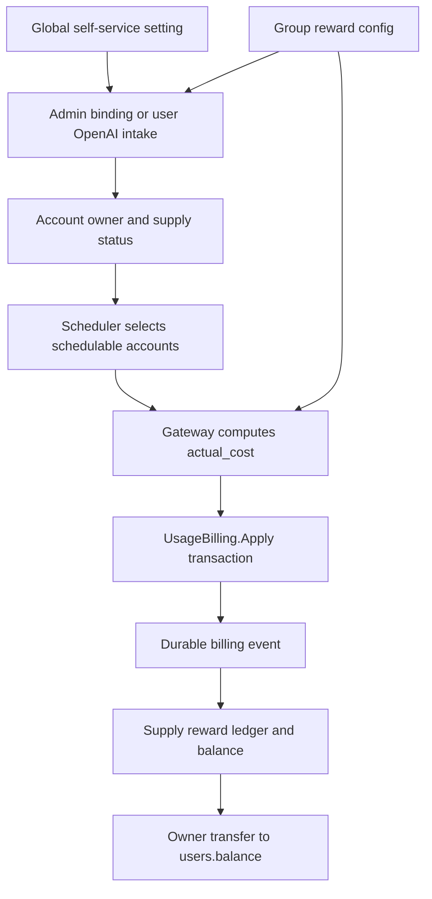
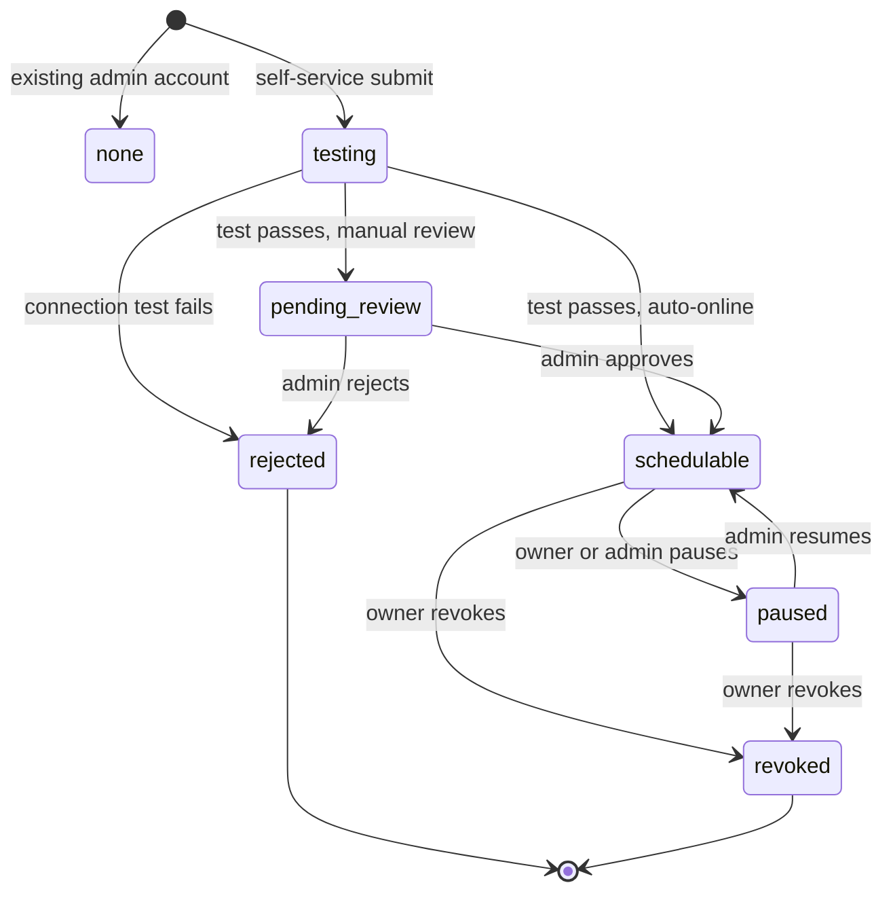
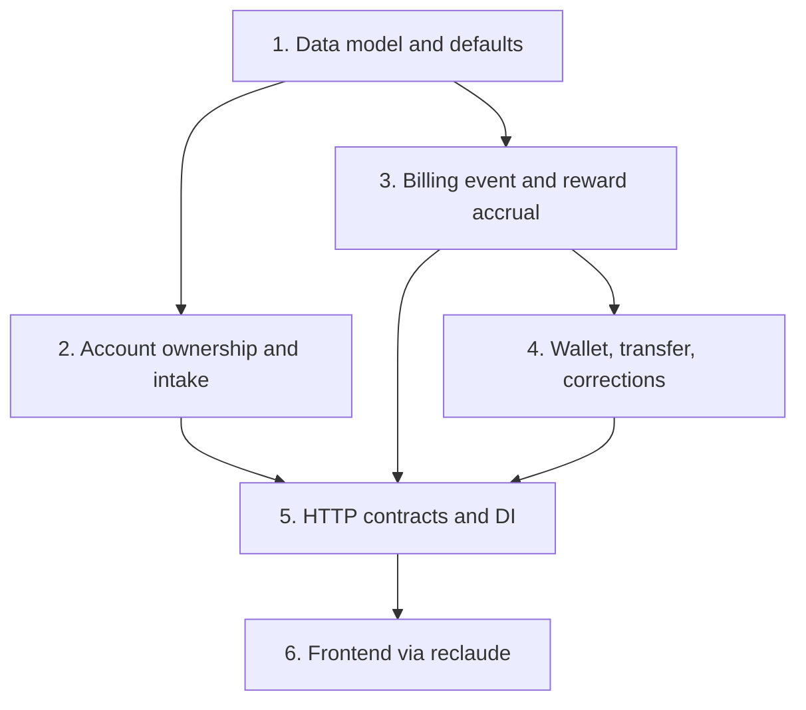
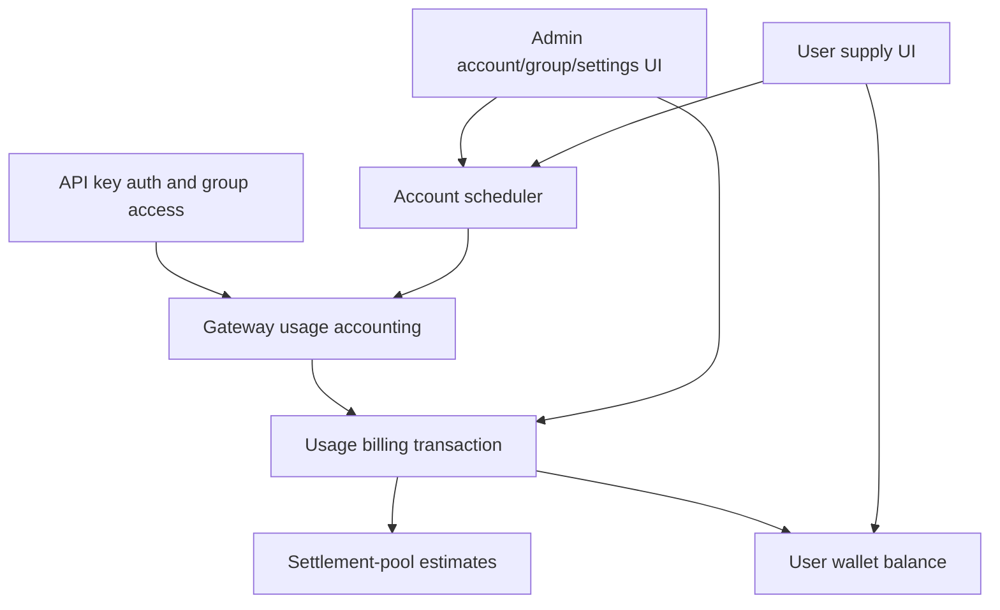

# Plan: Resource Supply Credit

## Overview

Resource supply credit lets an account owner contribute their own model account to any eligible group, earn a supply-credit reward when requests are routed through that account, and later transfer those earnings into the normal site-wide wallet balance.

The feature is intentionally split into three concerns:

| Concern | What changes | What must stay unchanged |
|---|---|---|
| Group configuration | Admin can enable supply rewards, set reward multiplier `k`, and choose review policy per group | User billing price, subscription limits, settlement-pool formulas, and existing group rate multipliers do not change |
| Account ownership | An account may have a supply owner and a supply intake state | Existing admin-created accounts without owners remain schedulable exactly as before |
| Reward wallet | Owner earns `actual_cost * k` into a separate supply earnings balance, then transfers to `users.balance` manually | Rewards do not bypass idempotency, credential privacy, or normal wallet audit rules |

Self-service intake starts with OpenAI OAuth and OpenAI API keys only. Admin-managed owner binding is platform-agnostic so later account types can earn rewards without needing a user-facing intake flow first.

## Problem Frame

The current credit and wallet surfaces let users recharge, spend, and receive existing credit-like adjustments, but they do not let a user contribute idle model capacity and earn transferable site credit when that capacity is used. The new module must connect account ownership, group policy, request billing, settlement-pool accounting, and wallet transfer without weakening the existing billing invariants.

The hardest part is not the UI. It is making the reward event line up with the same durable accounting event that proves a request really consumed value. Balance and subscription paths already have transactional effects; settlement-pool mode currently relies on best-effort usage logs for later estimates, so this plan adds a durable usage billing event source before paying settlement-pool rewards.

## Requirements Trace

The origin document is `docs/brainstorms/2026-04-30-resource-supply-credit-requirements.md`.

| ID | Requirement | Plan coverage |
|---|---|---|
| R1 | Global setting controls user self-service intake, default off | Unit 1 and Unit 5 add `resource_supply_self_service_enabled`; Unit 6 hides submit controls when off |
| R2 | Each group independently enables/disables supply rewards | Unit 1 group schema and Unit 6 admin group UI |
| R3 | Each group configures reward multiplier `k`, default `1` | Unit 1 schema/defaults, Unit 3 request-time snapshot |
| R4 | Each group configures self-service review policy | Unit 1 stores policy; Unit 2 applies manual review vs auto-online |
| R5 | Group reward config must not change caller billing, subscription limits, or settlement-pool rules | Unit 3 separates reward calculation from billing/settlement calculation |
| R6 | Admin can bind/change/clear one account owner | Unit 2 admin ownership workflows |
| R7 | First self-service methods are OpenAI OAuth and OpenAI API Key | Unit 2 and Unit 6 |
| R8 | Self-service only when global setting is on and target group supports rewarded OpenAI scheduling | Unit 2 validates setting/group/platform; Unit 6 mirrors server state |
| R9 | Self-service account states cover testing, pending review, schedulable, paused, rejected | Unit 1 account fields and Unit 2 state machine |
| R10 | Manual-review vs auto-online policy controls post-test state | Unit 2 state transitions |
| R11 | Admin can approve, reject, pause, resume, and leave user-visible reason | Unit 2 admin workflows and Unit 6 admin UI |
| R12 | Paused/rejected/testing/pending accounts are not scheduled and earn no new rewards | Unit 1 scheduler filters and Unit 3 reward eligibility |
| R13 | Owner can pause/revoke own submitted account, preserving historical rewards | Unit 2 owner workflows and Unit 4 immutable ledger |
| R14 | Credentials are sensitive and never shown in plaintext | Unit 2 DTO boundaries, Unit 5 safe DTOs, Unit 6 UI masking |
| R15 | Reward requires successful real billing/accounting, enabled group, and owner on scheduled account | Unit 3 transactional billing event and reward accrual |
| R16 | Real accounting includes balance deduction, subscription usage update, and settlement-pool usage accounting | Unit 3 durable billing event and settlement-pool parity work |
| R17 | Reward amount is `actual_cost * k` using request-time group multiplier | Unit 3 calculation and snapshot fields |
| R18 | Balance, subscription, and settlement-pool billing can all generate rewards | Unit 3 handles all billing types |
| R19 | Owner self-use still generates reward | Unit 3 tests caller and owner can match |
| R20 | Duplicate billing/idempotency cannot double reward | Unit 3 unique event/reward keys and tests |
| R21 | `actual_cost <= 0` creates no positive reward | Unit 3 eligibility |
| R22 | Reward ledger traces group/account/owner/caller/time/cost without secrets | Unit 4 ledger model and Unit 5 DTOs |
| R23 | Reward goes to separate supply earnings balance | Unit 4 wallet model |
| R24 | User can view supply balance, lifetime totals, transfers, and chronological ledger | Unit 4 API and Unit 6 user page |
| R25 | User can manually transfer available supply earnings to main balance | Unit 4 transfer transaction |
| R26 | Transferred credit becomes normal site-wide `balance` | Unit 4 transfer transaction |
| R27 | Transfer is audited and idempotent | Unit 4 idempotency helper and ledger |
| R28 | Admin can view reward ledger and manually correct with notes | Unit 4 admin correction API and Unit 6 admin view |
| R29 | Admin can see owner/source/status/group/k/recent earnings/pending accounts | Unit 2 account metadata, Unit 5 admin DTOs, Unit 6 admin UI |
| R30 | User can see own accounts, statuses, groups, and earnings summaries | Unit 5 user DTOs and Unit 6 user UI |
| R31 | User cannot see other owners' credentials, wallets, or sensitive routing data | Unit 5 authorization/DTO tests and Unit 6 UI boundaries |
| R32 | User UI should be compact operational tooling, not long explanatory copy | Unit 6 frontend handoff constraints |

## Scope

In scope:

- Add persistent ownership/status fields for resource-supplied accounts.
- Add group reward configuration and a global self-service setting.
- Add a supply earnings wallet, immutable reward/transfer/adjustment ledger, and manual transfer into `users.balance`.
- Accrue rewards atomically from the existing billing path using `actual_cost` and request-time group/account snapshots.
- Support admin-bound rewards for any platform/group where the account can already be scheduled.
- Support user self-service submission for OpenAI OAuth and OpenAI API key accounts.
- Add admin and user HTTP contracts.
- Add frontend screens and controls, implemented by the later frontend-only `reclaude` handoff.

Out of scope for this first delivery:

- Cash withdrawal from supply earnings.
- Marketplace pricing, bidding, or routing priority based on reward rates.
- User self-service intake for non-OpenAI providers.
- Automatic conversion into non-site currencies.
- Changing how users are charged for usage.

## Context And Research

Backend:

- `backend/internal/service/usage_billing.go` defines `UsageBillingCommand` and request fingerprinting.
- `backend/internal/repository/usage_billing_repo.go` applies billing in a SQL transaction and claims `(request_id, api_key_id)` idempotency keys.
- `backend/internal/service/gateway_service.go` and `backend/internal/service/openai_gateway_service.go` compute `CostBreakdown.ActualCost`, set `BillingTypeBalance`, `BillingTypeSubscription`, or `BillingTypeSettlementPool`, then call `applyUsageBilling`.
- `backend/internal/repository/settlement_pool_repo.go` currently estimates settlement-pool usage from `usage_logs`.
- `backend/internal/service/account.go`, `backend/ent/schema/account.go`, and `backend/internal/repository/account_repo.go` own schedulability rules.
- `backend/internal/service/group.go`, `backend/ent/schema/group.go`, and `backend/internal/service/admin_service.go` own group configuration.
- `backend/internal/service/openai_oauth_service.go` and `backend/internal/handler/admin/openai_oauth_handler.go` already implement admin OpenAI OAuth flows.
- `backend/internal/repository/affiliate_repo.go` and `backend/internal/service/affiliate_service.go` provide the closest local pattern for separate earnings balance plus transfer to `users.balance`.
- `backend/internal/handler/idempotency_helper.go` and `backend/internal/handler/admin/idempotency_helper.go` provide existing idempotent write helpers.

Frontend:

- `frontend/src/views/user/AffiliateView.vue` is the closest user wallet/transfer UI reference.
- `frontend/src/views/admin/SettingsView.vue` has existing global setting controls.
- `frontend/src/views/admin/GroupsView.vue` has group create/edit forms and OpenAI dispatch controls.
- `frontend/src/views/admin/AccountsView.vue`, `frontend/src/components/account/CreateAccountModal.vue`, and `frontend/src/components/account/EditAccountModal.vue` own admin account management.
- `frontend/src/composables/useOpenAIOAuth.ts` currently targets admin OpenAI OAuth endpoints and must not be reused unmodified for user self-service.
- `frontend/src/router/index.ts`, `frontend/src/components/layout/AppSidebar.vue`, `frontend/src/stores/app.ts`, and `frontend/src/utils/featureFlags.ts` own route/sidebar/public-setting wiring.

Institutional learnings:

- No `docs/solutions/` directory exists in this repo, so there were no durable local solution notes to incorporate.

External research:

- Not used for this plan. The feature is governed by existing local billing, credential, idempotency, wallet, and Vue admin/user patterns rather than a new third-party protocol. OpenAI OAuth/API-key behavior should reuse the already-present local OpenAI service patterns.

## Technical Decisions

| Decision | Choice | Rationale |
|---|---|---|
| Supply owner state | Store current owner/source/status on `accounts`; store money movement in dedicated supply wallet tables | Scheduler/admin account views need ownership state near the account; money movement needs a separate immutable ledger |
| Default review policy | `manual_review` | User-supplied accounts can create cost/reliability risk, so the safe default is review before scheduling |
| Reward eligibility | Based on a transactionally persisted billing/accounting event, not usage-log best effort | Rewards must not be created for requests that the system failed to account for |
| Billing event source | Add a transactional usage billing event row written by `UsageBillingRepository.Apply` | Existing usage logs are best-effort analytics; supply rewards and settlement-pool reward eligibility need a durable accounting source |
| Settlement-pool usage | Move settlement-pool cycle usage reads to the durable billing event source with a compatibility backfill/union for pre-cutover rows | Settlement-pool rewards must agree with settlement-pool accounting instead of depending on lossy usage logs |
| Reward amount | `actual_cost * supply_reward_multiplier`, rounded with the repo's existing money precision conventions | Requirement uses actual user billing/accounting value, not raw provider cost |
| Snapshot semantics | Pass request-time `group_id`, owner, multiplier, billing type, and costs into `UsageBillingCommand` | Admin changes after request start must not rewrite the reward rate or owner for that request |
| Transfer behavior | Transfer all available supply earnings into `users.balance` in one idempotent transaction | Matches affiliate transfer ergonomics and avoids partial transfer edge cases |
| `total_recharged` | Increment consistently with existing positive balance-credit paths unless product reporting explicitly separates it later | Keeps low-balance and wallet-derived behavior aligned with affiliate transfer; supply ledger remains the source for supply-specific reporting |
| Self-service setting | Gates only user submission controls and APIs | Admin binding and reward accrual must continue regardless of the self-service switch |
| Credential exposure | User APIs return only masked metadata and operational status | Prevents normal users from receiving admin account DTOs that include credential material |

## High-Level Design

This illustrates the intended approach and is directional guidance for review, not implementation specification. The implementing agent should treat it as context, not code to reproduce.



Account status lifecycle:



Scheduling invariant:

- Existing accounts with `supply_status = none` keep their current behavior.
- Supply-owned accounts are schedulable only when normal account status is active, normal schedulability checks pass, and `supply_status = schedulable`.
- Pending, testing, paused, rejected, and revoked accounts are filtered both by service-level `Account.IsSchedulable()` and by repository scheduler queries.

Reward invariant:

- A reward is created only when `UsageBillingRepository.Apply` claims the idempotency key and writes the durable billing event.
- If the reward insert or supply balance update fails, the billing transaction fails. This is intentional: reward loss must surface instead of being hidden.
- Duplicate requests return `Applied=false` and cannot create another reward.

## Implementation Units



### - [ ] Unit 1: Persistent Data Model And Defaults

Goal: Add database, Ent, service, and default-setting primitives without changing runtime behavior for existing accounts.

Requirements: R1, R2, R3, R4, R6, R9, R16, R22, R23.

Dependencies: None.

Patterns to follow:

- `backend/migrations/130_add_user_affiliates.sql` through `backend/migrations/133_affiliate_rebate_freeze.sql` for wallet-like persistent data.
- `backend/ent/schema/account.go` and `backend/ent/schema/group.go` for schema conventions.
- `backend/internal/service/setting_service.go` and `backend/internal/service/settings_view.go` for default setting and public setting patterns.

Files:

- Create `backend/migrations/135_add_resource_supply_credit.sql`.
- Modify `backend/ent/schema/account.go`.
- Modify `backend/ent/schema/group.go`.
- Create `backend/ent/schema/resource_supply_balance.go`.
- Create `backend/ent/schema/resource_supply_ledger.go`.
- Create or modify an Ent schema for durable usage billing events, for example `backend/ent/schema/usage_billing_event.go`.
- Modify `backend/internal/service/account.go`.
- Modify `backend/internal/service/group.go`.
- Modify `backend/internal/repository/account_repo.go`.
- Modify `backend/internal/repository/group_repo.go`.
- Modify `backend/internal/service/domain_constants.go`.
- Modify `backend/internal/service/setting_service.go`.
- Modify `backend/internal/service/settings_view.go`.
- Modify `backend/internal/handler/dto/settings.go`.

Data shape:

- Add group fields:
  - `supply_rewards_enabled` boolean, default false.
  - `supply_reward_multiplier` numeric/decimal, default `1`, validation `>= 0`.
  - `supply_self_service_review_policy` string enum, default `manual_review`, values `manual_review` and `auto_online`.
- Add account fields:
  - `supply_owner_user_id` nullable FK to `users`.
  - `supply_source` enum/string: `admin`, `self_service`, or null/`none`.
  - `supply_status` enum/string: `none`, `testing`, `pending_review`, `schedulable`, `paused`, `rejected`, `revoked`.
  - `supply_status_reason`, `supply_submitted_by`, `supply_reviewed_by`, `supply_reviewed_at` as audit metadata.
- Add supply balance table keyed by `user_id`:
  - available amount.
  - lifetime earned amount.
  - lifetime transferred amount.
  - timestamps.
- Add supply ledger table:
  - owner user id, caller user id, api key id, group id, account id.
  - billing event id or request id/api key id pair.
  - ledger type: reward, transfer, adjustment.
  - signed amount, balance after, actual cost, multiplier snapshot.
  - billing type, model, request id, created/admin metadata, note.
  - no credential fields.
- Add durable usage billing event table:
  - one row per successfully applied usage billing idempotency key.
  - request id, api key id, user id, group id, account id, billing type, model, token counts.
  - total cost, actual cost, subscription/balance/account quota costs.
  - unique `(request_id, api_key_id)`.

Migration considerations:

- Existing accounts must backfill to `supply_status = none` and `supply_owner_user_id = NULL`.
- Existing groups must backfill rewards disabled, multiplier `1`, review policy `manual_review`.
- Backfill durable billing events from existing `usage_logs` where possible before switching settlement-pool estimates. If request/api key uniqueness cannot be guaranteed for all historical logs, keep a compatibility `UNION` for pre-cutover settlement-pool rows until all active pre-cutover cycles are locked.
- Historical backfill is for settlement-pool accounting continuity only. It must mark rows as backfilled/non-reward-eligible and must not create historical supply reward ledger rows.
- Use explicit check constraints for enum-like fields and non-negative balances/multipliers.

Tests:

- Update `backend/internal/repository/migrations_schema_integration_test.go` for new columns, tables, and constraints.
- Update `backend/internal/repository/migrations_runner_checksum_test.go` if the migration runner requires checksum registration.
- Update `backend/internal/service/admin_service_group_test.go` for default group supply config, validation, and update behavior.
- Update `backend/internal/handler/dto/public_settings_injection_schema_test.go` if the self-service setting is exposed through public settings.

Required scenarios:

- Migration preserves existing account schedulability when `supply_status = none`.
- New groups default to rewards disabled, multiplier `1`, manual review.
- Invalid negative multiplier is rejected.
- Unknown review policy/status is rejected.
- Public setting default is false.

Verification:

- Existing accounts and groups load with backward-compatible defaults.
- New schema fields are visible in service DTO mappings without exposing secrets.
- Migration/backfill strategy is explicit for active settlement-pool data.

### - [ ] Unit 2: Account Ownership And Self-Service Intake

Goal: Let admins bind owners to accounts, let users submit OpenAI accounts when allowed, and enforce supply states in scheduling.

Requirements: R1, R6, R7, R8, R9, R10, R11, R12, R13, R14, R29, R30, R31.

Dependencies: Unit 1.

Patterns to follow:

- `backend/internal/service/account.go` for account status and schedulability rules.
- `backend/internal/repository/account_repo.go` for scheduler query filters.
- `backend/internal/service/openai_oauth_service.go` for credential construction.
- `backend/internal/service/account_test_service.go` for connection testing.

Files:

- Create `backend/internal/service/resource_supply_service.go`.
- Create or extend `backend/internal/repository/resource_supply_repo.go`.
- Modify `backend/internal/service/account.go`.
- Modify `backend/internal/repository/account_repo.go`.
- Modify `backend/internal/service/admin_service.go`.
- Modify `backend/internal/handler/admin/account_handler.go`.
- Modify `backend/internal/service/openai_oauth_service.go` only if a user-scoped wrapper needs additional validation hooks.
- Add user-scoped handler code in Unit 5 for self-service endpoints.
- Modify `backend/internal/repository/scheduler_cache.go` if account snapshot serialization needs the new supply status fields.
- Modify `backend/internal/repository/scheduler_outbox_repo.go` only if a new outbox event type is needed; otherwise reuse account-changed events.

Behavior:

- Admin can bind, change, or clear `supply_owner_user_id` on an account.
- Admin can set supply status, status reason, and review metadata.
- Admin-bound accounts may be marked `schedulable` immediately if the normal account state allows it.
- User self-service validates:
  - global `resource_supply_self_service_enabled` is true.
  - target group exists, is active, supports OpenAI routing for the selected method, and has supply rewards enabled.
  - group `require_oauth_only` rejects API key submissions.
  - user owns only the account they are submitting.
- OpenAI API key submission:
  - stores credentials using the same secure account credential path as admin account creation.
  - tests the account connection before moving past `testing`.
  - moves to `pending_review` or `schedulable` based on group policy.
- OpenAI OAuth submission:
  - uses user-scoped generate/exchange endpoints.
  - does not expose admin OAuth endpoints to normal users.
  - builds credentials through `OpenAIOAuthService` and then follows the same test and state policy as API key submission.
- Owner actions:
  - pause own `self_service` account.
  - revoke own `self_service` account.
  - cannot see or mutate other users' accounts.
- Self-service submit/test endpoints must reuse existing authenticated write throttling if present. If no suitable throttling exists, add an explicit per-user limiter for credential test attempts because this endpoint crosses an upstream-provider trust boundary.
- Every status change that affects scheduling must enqueue/trigger the same scheduler invalidation/outbox behavior used by account updates.

Tests:

- Add `backend/internal/service/resource_supply_service_test.go`.
- Update `backend/internal/repository/account_repo_integration_test.go` for schedulable filters by supply status.
- Update `backend/internal/repository/scheduler_cache_unit_test.go` or `backend/internal/repository/scheduler_cache_integration_test.go` if scheduler cache snapshots include supply fields.
- Update `backend/internal/service/admin_service_group_test.go` or add `backend/internal/service/admin_service_resource_supply_test.go` for owner bind/change/clear and approve/reject.

Required scenarios:

- Self-service disabled returns an explicit forbidden/bad request error for submissions.
- Group rewards disabled rejects user self-service submission.
- OpenAI API key submission is rejected for `require_oauth_only` groups.
- Manual review groups produce `pending_review` accounts that are not schedulable.
- Auto-online groups produce `schedulable` accounts after a successful connection test.
- Test failure does not create a schedulable account.
- Owner pause/revoke removes the account from scheduler queries and preserves historical ledger rows.
- Admin can bind an owner to an existing account without exposing credentials to that owner.

Verification:

- Scheduler-visible account lists exclude every non-schedulable supply state.
- Admin and owner state transitions update scheduler/cache state through existing invalidation paths.
- User self-service creates only OpenAI accounts and never uses admin-only OAuth routes.

### - [ ] Unit 3: Durable Billing Event And Reward Accrual

Goal: Accrue supply rewards exactly once from the atomic usage billing path for balance, subscription, and settlement-pool billing types.

Requirements: R5, R12, R15, R16, R17, R18, R19, R20, R21, R22.

Dependencies: Unit 1 for schema and Unit 2 for account owner/status snapshots.

Patterns to follow:

- `backend/internal/repository/usage_billing_repo.go` for transaction and idempotency structure.
- `backend/internal/service/usage_billing.go` for fingerprint normalization.
- `backend/internal/service/gateway_service.go` and `backend/internal/service/openai_gateway_service.go` for cost calculation and billing type selection.
- `backend/internal/repository/settlement_pool_repo.go` for settlement usage aggregation.

Files:

- Modify `backend/internal/service/usage_billing.go`.
- Modify `backend/internal/repository/usage_billing_repo.go`.
- Modify `backend/internal/service/gateway_service.go`.
- Modify `backend/internal/service/openai_gateway_service.go`.
- Modify `backend/internal/repository/settlement_pool_repo.go`.
- Modify `backend/internal/service/settlement_pool.go` only if the repository interface needs an explicit durable-event source method.

Command changes:

- Add to `UsageBillingCommand`:
  - `GroupID`.
  - `TotalCost`.
  - `ActualCost`.
  - request-time `SupplyRewardEligible`.
  - request-time `SupplyOwnerUserID`.
  - request-time `SupplyRewardMultiplier`.
  - optional `SupplyAccountStatus` for fingerprint/audit validation.
- Include new economic fields in `buildUsageBillingFingerprint`.
- Build these fields in both gateway services from the selected account and group snapshots.
- Keep balance/subscription charge fields as they are; supply reward calculation is additive and separate.

Repository transaction:

1. Claim `(request_id, api_key_id)` in `usage_billing_dedup`.
2. Apply existing billing effects: subscription usage, balance deduction, API key quota/rate limit, account quota.
3. Insert durable usage billing event row with billing type, group/account/user, costs, token counts, and request snapshot.
4. If reward eligible:
   - validate `actual_cost > 0`.
   - validate group rewards snapshot enabled.
   - validate owner snapshot exists.
   - validate account supply status snapshot was schedulable.
   - calculate reward as `actual_cost * multiplier`.
   - insert one reward ledger row linked to the durable billing event.
   - upsert/increment supply balance.
5. Commit.

Settlement-pool accounting:

- `BillingTypeSettlementPool` has no balance/subscription deduction, so the durable billing event is the accounting event that allows reward accrual.
- Update settlement-pool usage aggregation to read the durable event source for newly applied requests.
- Preserve active-cycle correctness by backfilling from `usage_logs` or by unioning pre-cutover `usage_logs` until all active cycles that began before the migration are closed.
- Add tests proving settlement-pool estimates and supply rewards use the same persisted events after cutover.

Failure behavior:

- If any event/reward write fails, `UsageBillingRepository.Apply` returns an error and rolls back.
- `recordUsageCore` already skips usage-log write when billing returns an error; keep that behavior.
- Usage logs remain analytics/best-effort after successful billing. They are not the source of reward truth.
- Simple mode remains unbilled and creates no supply rewards.

Tests:

- Extend `backend/internal/repository/usage_billing_repo_integration_test.go`.
- Extend `backend/internal/service/gateway_record_usage_test.go`.
- Extend `backend/internal/service/openai_gateway_record_usage_test.go`.
- Extend `backend/internal/repository/settlement_pool_repo_test.go`.

Required scenarios:

- Balance billing deducts balance and creates one reward.
- Subscription billing increments subscription usage and creates one reward.
- Settlement-pool billing writes a durable accounting event and creates one reward.
- Duplicate `(request_id, api_key_id)` does not create another reward.
- Fingerprint conflict still errors.
- Group rewards disabled creates billing event but no reward.
- No supply owner creates billing event but no reward.
- `actual_cost <= 0` creates no positive reward.
- Owner self-use creates a reward.
- Request-time `k` is used even if the group multiplier changes before later reads.
- Reward write failure rolls back the billing event and billing effects.
- Settlement-pool active-cycle estimate agrees with durable event totals.

Verification:

- One successful applied billing command creates at most one durable billing event and at most one reward.
- Settlement-pool reward eligibility and settlement-pool estimate totals are derived from the same durable accounting source for new requests.
- Existing balance/subscription billing effects remain unchanged except for the additional event/reward writes.

### - [ ] Unit 4: Supply Wallet, Transfer, Ledger, And Corrections

Goal: Expose supply earnings as a separate auditable wallet and let users transfer all available earnings into the normal wallet balance.

Requirements: R13, R22, R23, R24, R25, R26, R27, R28, R31.

Dependencies: Unit 1 supply wallet tables and Unit 3 reward ledger rows.

Patterns to follow:

- `backend/internal/repository/affiliate_repo.go` for aggregate earnings row, row locking, transfer ledger, and balance crediting.
- `backend/internal/service/affiliate_service.go` for service-level transfer orchestration and cache invalidation.
- `backend/internal/handler/idempotency_helper.go` for user idempotent writes.

Files:

- Continue `backend/internal/service/resource_supply_service.go`.
- Continue `backend/internal/repository/resource_supply_repo.go`.
- Modify `backend/internal/service/user.go` or wallet/user service only if balance cache invalidation is owned there.
- Modify billing cache/auth cache invalidation hooks as needed after transfer.

Behavior:

- User summary returns:
  - available supply earnings.
  - lifetime earned.
  - lifetime transferred.
  - owned account count by status.
  - recent ledger rows.
  - whether self-service submission is currently enabled.
- User ledger supports paging and filters by ledger type/status.
- Transfer:
  - requires an `Idempotency-Key`.
  - locks the user's supply balance row with `FOR UPDATE`.
  - fails explicitly when available amount is zero.
  - inserts a negative supply ledger transfer row and increments `users.balance`.
  - increments `users.total_recharged` consistently with affiliate transfer unless product reporting decides otherwise in a later change.
  - invalidates balance/auth caches needed for immediate spending.
- Admin ledger:
  - supports filters by owner, caller, group, account, type, date, and request id.
  - returns no credentials.
- Admin correction:
  - requires note.
  - supports positive and negative signed amounts.
  - rejects negative corrections that would make available supply earnings below zero.
  - writes admin id, note, and balance-after audit data.

Tests:

- Add `backend/internal/repository/resource_supply_repo_integration_test.go`.
- Add `backend/internal/service/resource_supply_service_test.go`.

Required scenarios:

- Transfer is idempotent on replay and does not double-credit `users.balance`.
- Concurrent transfers serialize and only one succeeds for the same available amount.
- Empty transfer fails with a clear domain error.
- Positive admin correction increases available and writes a note.
- Negative admin correction cannot overdraw available earnings.
- User ledger shows reward, transfer, and adjustment rows without credentials.
- Transfer cache invalidation makes the new balance spendable through existing billing checks.

Verification:

- The supply ledger can reconstruct every available-balance change.
- Transfer replay returns the same result without another wallet credit.
- Admin corrections are fully audited and cannot silently clamp invalid balances.

### - [ ] Unit 5: HTTP Contracts, DTOs, Routes, And DI

Goal: Wire services into explicit admin/user APIs with safe DTOs and idempotent writes.

Requirements: R1, R6, R7, R8, R11, R13, R14, R22, R24, R25, R27, R28, R29, R30, R31.

Dependencies: Units 1 through 4.

Patterns to follow:

- `backend/internal/server/routes/user.go` and `backend/internal/server/routes/admin.go` for route organization.
- `backend/internal/handler/idempotency_helper.go` and `backend/internal/handler/admin/idempotency_helper.go` for retry-safe writes.
- Existing admin account/group/settings handlers for DTO mapping and authorization checks.

Files:

- Create `backend/internal/handler/resource_supply_handler.go`.
- Create `backend/internal/handler/admin/resource_supply_handler.go`.
- Modify `backend/internal/handler/handlers.go`.
- Modify `backend/internal/server/routes/user.go`.
- Modify `backend/internal/server/routes/admin.go`.
- Modify `backend/cmd/server/wire.go`.
- Modify `backend/cmd/server/wire_gen.go`.
- Modify `backend/internal/handler/dto/settings.go`.
- Modify `backend/internal/service/settings_view.go`.
- Modify `backend/internal/handler/admin/setting_handler.go`.
- Modify `backend/internal/handler/admin/group_handler.go`.
- Modify `backend/internal/handler/admin/account_handler.go`.
- Modify `backend/internal/handler/dto/mappers.go`.
- Modify `backend/internal/handler/dto/types.go`.

Proposed user endpoints:

- `GET /api/v1/user/resource-supply`
- `GET /api/v1/user/resource-supply/ledger`
- `POST /api/v1/user/resource-supply/accounts/openai-api-key`
- `POST /api/v1/user/resource-supply/openai/generate-auth-url`
- `POST /api/v1/user/resource-supply/openai/exchange-code`
- `POST /api/v1/user/resource-supply/accounts/:id/pause`
- `POST /api/v1/user/resource-supply/accounts/:id/revoke`
- `POST /api/v1/user/resource-supply/transfer`

Proposed admin endpoints:

- Extend group create/update/read DTOs with supply config fields.
- Extend account create/update/read DTOs with owner/status metadata.
- `GET /api/v1/admin/resource-supply/ledger`
- `POST /api/v1/admin/resource-supply/accounts/:id/approve`
- `POST /api/v1/admin/resource-supply/accounts/:id/reject`
- `POST /api/v1/admin/resource-supply/accounts/:id/pause`
- `POST /api/v1/admin/resource-supply/accounts/:id/resume`
- `POST /api/v1/admin/resource-supply/adjustments`

DTO rules:

- Every user route requires the existing authenticated-user middleware; every admin route requires the existing admin middleware.
- User account DTOs contain account id, group metadata, platform/type, masked credential metadata, status, reason, and timestamps.
- User DTOs never include `credentials`, raw OAuth tokens, API keys, refresh tokens, or admin-only account configuration.
- Admin DTOs may include operational account metadata but should continue existing masking rules for secrets.
- Ledger DTOs include request/account/group/user/cost/multiplier traces but no secrets.

Write safety:

- Use `executeUserIdempotentJSON` for user transfer and self-service account writes.
- Use `executeAdminIdempotentJSON` for admin approvals/rejections/corrections when the action can be retried.
- Return explicit errors for invalid status transitions, disabled self-service, unsupported group/provider, and connection-test failures.

Tests:

- Add `backend/internal/handler/resource_supply_handler_test.go`.
- Add `backend/internal/handler/admin/resource_supply_handler_test.go`.
- Update group/account/settings handler tests.
- Update `backend/internal/handler/dto/public_settings_injection_schema_test.go`.

Required scenarios:

- User can see only their own supply accounts and ledger rows.
- User cannot call admin OpenAI OAuth endpoints.
- User submission APIs require global self-service enabled.
- Admin ledger filters by owner/group/account/request id.
- Admin correction requires a note.
- Public settings include the self-service flag when frontend needs it.
- Route wiring works after Wire regeneration.

Verification:

- User routes enforce ownership and never serialize secret fields.
- Admin routes expose the full operational review/correction surface.
- Public settings and frontend-consumed DTOs are stable enough for the delegated frontend unit.

### - [ ] Unit 6: Frontend Experience Delegated To `reclaude`

Goal: Implement the frontend after backend contracts are stable. This unit should be executed by a frontend-only `reclaude -p` handoff and reviewed by Codex before acceptance.

Requirements: R1, R2, R3, R4, R6, R7, R8, R9, R10, R11, R13, R14, R22, R24, R25, R27, R28, R29, R30, R31, R32.

Dependencies: Unit 5 API contracts.

Patterns to follow:

- `frontend/src/views/user/AffiliateView.vue` for wallet and transfer patterns.
- `frontend/src/views/admin/SettingsView.vue` for global toggles.
- `frontend/src/views/admin/GroupsView.vue` for group create/edit config controls.
- `frontend/src/views/admin/AccountsView.vue` for account tables, filters, and row actions.
- `frontend/src/composables/useOpenAIOAuth.ts` as a pattern to parameterize or wrap, not as an admin endpoint to call directly.

Frontend ownership:

- The delegated frontend worker may edit files under `frontend/` only.
- It must not edit `backend/`, migrations, generated backend files, deployment files, or this plan.
- It should follow existing Vue 3, Pinia, Vue Router, i18n, Tailwind, and component patterns.
- It should use compact operational UI, status badges, tables, forms, and existing controls. Avoid landing-page style copy.

Files likely touched:

- Create `frontend/src/views/user/ResourceSupplyView.vue`.
- Create `frontend/src/api/resourceSupply.ts`.
- Create `frontend/src/api/admin/resourceSupply.ts`.
- Modify `frontend/src/types/index.ts`.
- Modify `frontend/src/api/user.ts` if the project prefers user APIs in one file.
- Modify `frontend/src/api/admin/accounts.ts`.
- Modify `frontend/src/api/admin/groups.ts`.
- Modify `frontend/src/api/admin/settings.ts`.
- Modify `frontend/src/router/index.ts`.
- Modify `frontend/src/components/layout/AppSidebar.vue`.
- Modify `frontend/src/stores/app.ts`.
- Modify `frontend/src/utils/featureFlags.ts` if public-setting gating is added there.
- Modify `frontend/src/views/admin/SettingsView.vue`.
- Modify `frontend/src/views/admin/GroupsView.vue`.
- Modify `frontend/src/views/admin/AccountsView.vue`.
- Modify `frontend/src/components/account/CreateAccountModal.vue`.
- Modify `frontend/src/components/account/EditAccountModal.vue`.
- Modify or wrap `frontend/src/composables/useOpenAIOAuth.ts`.
- Modify locale files such as `frontend/src/i18n/locales/zh.ts` and any existing English locale.

User experience:

- Add a Resource Supply route.
- Show supply earnings available, lifetime earned, lifetime transferred, and transfer action.
- Show owned accounts with group, platform/type, masked metadata, status, reason, and actions.
- Show OpenAI OAuth and OpenAI API key submission controls only when self-service is enabled.
- Hide raw secrets immediately after submission; never echo API keys or OAuth tokens.
- Show ledger rows with type, amount, group/account, caller/request metadata, and created time.

Admin experience:

- Settings page: add global self-service intake toggle, default off.
- Groups page: add supply reward enable switch, multiplier input, and review policy control.
- Accounts page: show owner/status columns or expandable detail, filters for pending review/owner, and approve/reject/pause/resume actions.
- Add admin ledger/correction UI in the most consistent existing admin surface.

Frontend tests:

- Add `frontend/src/views/user/__tests__/ResourceSupplyView.spec.ts`.
- Add or update `frontend/src/views/admin/__tests__/SettingsView.spec.ts`.
- Add or update `frontend/src/views/admin/__tests__/GroupsView.spec.ts`.
- Add or update `frontend/src/views/admin/__tests__/AccountsView.spec.ts`.
- Add or update `frontend/src/composables/__tests__/useOpenAIOAuth.spec.ts` if endpoint prefixing changes.
- Add or update `frontend/src/components/layout/__tests__/AppSidebar.spec.ts` if sidebar visibility changes.

Suggested `reclaude` handoff command:

```bash
reclaude -p "$(cat <<'PROMPT'
You are implementing only the frontend portion of the resource supply credit feature in this repo.

Hard boundary:
- Edit frontend/ files only.
- Do not edit backend/, migrations, generated backend files, deployment files, or docs/plans.
- Backend contracts are defined in docs/plans/2026-04-30-001-feat-resource-supply-credit-plan.md. If a backend field name is not implemented yet, use a small typed API adapter so Codex can align names during integration review.

Read first:
- docs/brainstorms/2026-04-30-resource-supply-credit-requirements.md
- docs/plans/2026-04-30-001-feat-resource-supply-credit-plan.md
- frontend/src/views/user/AffiliateView.vue
- frontend/src/views/admin/SettingsView.vue
- frontend/src/views/admin/GroupsView.vue
- frontend/src/views/admin/AccountsView.vue
- frontend/src/components/account/CreateAccountModal.vue
- frontend/src/components/account/EditAccountModal.vue
- frontend/src/components/layout/AppSidebar.vue
- frontend/src/stores/app.ts
- frontend/src/utils/featureFlags.ts
- frontend/src/api/user.ts
- frontend/src/api/admin/accounts.ts
- frontend/src/api/admin/groups.ts
- frontend/src/api/admin/settings.ts
- frontend/src/composables/useOpenAIOAuth.ts
- frontend/src/types/index.ts
- frontend/src/i18n/locales/zh.ts

Implement:
- User Resource Supply page with balance summary, transfer action, owned account table, OpenAI OAuth/API-key submission controls, and ledger table.
- Admin settings toggle for resource supply self-service.
- Group supply reward controls: enabled switch, multiplier k, review policy.
- Account owner/status visibility and review actions for pending supplied accounts.
- API clients and TypeScript types for the planned user/admin contracts.
- Route/sidebar/i18n wiring consistent with existing app patterns.
- Tests for the new user view and touched admin/composable/sidebar behavior where the repo has nearby test patterns.

Watch-outs:
- Never render raw credentials, OAuth access tokens, refresh tokens, or API keys.
- Do not reuse admin OpenAI OAuth endpoints for normal users. Parameterize the composable or create a user-scoped wrapper.
- The global setting gates submission controls, not existing balances, ledgers, admin binding, or reward visibility.
- Use compact operational UI: tables, status badges, toggles, number inputs, segmented/select controls. Avoid explanatory marketing sections.
- Keep text inside controls from overflowing on narrow screens.
- Preserve existing admin account/group/settings behavior while adding fields.

When done, report changed frontend files and the frontend test/build commands you ran.
PROMPT
)"
```

Verification:

- The frontend exposes all user and admin workflows in the requirements trace without rendering raw credentials.
- The global self-service setting only gates submission controls, not existing balance/ledger visibility.
- Codex reviews the `reclaude` diff before acceptance and aligns any field names with final backend DTOs.

## System-Wide Impact



Impacted invariants:

- API key auth remains responsible for user/group eligibility. Supply rewards do not grant group access.
- Scheduler must use the new supply status but keep existing non-supply account behavior.
- Usage billing remains the single atomic application point for billable request side effects.
- Settlement-pool cycle estimates must not regress for active production cycles.
- Wallet balance semantics remain unchanged after transfer: once transferred, supply credit is normal balance.
- User-facing DTOs must not reuse admin account DTOs that expose credentials.

## Risks And Mitigations

| Risk | Mitigation |
|---|---|
| Double rewards on retries | Keep reward accrual inside `UsageBillingRepository.Apply` after the dedup claim, with a unique reward/event key |
| Reward paid without durable accounting | Add durable billing events and make settlement-pool reward eligibility use that source |
| Settlement-pool active-cycle totals shift during migration | Backfill from `usage_logs` or union pre-cutover rows until active pre-cutover cycles close; add estimate parity tests |
| Historical backfill accidentally creates retroactive rewards | Mark backfilled accounting rows as non-reward-eligible and never generate reward ledger rows from historical backfill |
| Credentials leak through DTO reuse | Create user-safe DTOs and tests asserting credential fields are absent |
| Self-service credential testing is abused | Require authenticated users and add/reuse per-user submit/test throttling for provider validation attempts |
| Pending user accounts get scheduled | Add supply status checks in both service and repository scheduler filters |
| Admin changes `k` or owner during a request | Carry request-time snapshots into usage billing command and ledger |
| Transfer race double-credits balance | Use row locks plus idempotency key and ledger uniqueness |
| Frontend/backend contract drift | Finish backend contracts first, then hand frontend to `reclaude` with this plan as the source of truth |
| Reporting confusion around transferred credit | Keep supply ledger as the source for supply reporting; document `users.total_recharged` behavior in Unit 4 implementation |

## Acceptance Gates

Backend:

- Full backend test suite from `backend/`.
- Focused integration tests for usage billing reward idempotency.
- Focused settlement-pool estimate parity tests after the durable event change.
- Handler tests for user/admin resource supply APIs.
- Migration validation against a local database with active settlement-pool data shape.

Frontend:

- Relevant Vitest specs for the new user page and touched admin surfaces.
- TypeScript build or the existing frontend CI verification.
- Browser pass on desktop and mobile widths for:
  - user Resource Supply page.
  - admin Settings supply toggle.
  - admin Groups supply reward controls.
  - admin Accounts review/status controls.

Operational:

- Verify existing non-supply accounts still schedule.
- Verify self-service default is off after migration.
- Verify admin-bound owner rewards work even when self-service is off.
- Verify no logs/errors print submitted API keys or OAuth tokens.

## Operational And Migration Notes

- Rewards start from the deployed cutover path. Historical usage logs may be used only to preserve settlement-pool cycle accounting continuity, not to pay retroactive supply rewards.
- If active settlement-pool cycles exist at cutover, use a cutover timestamp or explicit backfill marker so `usage_logs` and durable billing events are not double-counted.
- Backfilled durable billing events should carry source metadata such as `source = backfill` and `reward_eligible = false`.
- The migration should be validated against a local database with active settlement-pool cycle data before any production deployment.
- If settlement-pool aggregation is switched from `usage_logs` to durable billing events, deploy the writer before or in the same release as the reader switch so new requests are never missing from the accounting source.
- The release should include an operator check that compares settlement-pool raw usage totals before and after the aggregation-source switch for at least one active cycle.

## Sequencing

1. Implement Unit 1 and regenerate Ent/Wire outputs only where required by compile.
2. Implement Unit 2 account ownership/status and scheduling guards.
3. Implement Unit 3 durable billing events and reward accrual, including settlement-pool accounting parity.
4. Implement Unit 4 wallet transfer and admin corrections.
5. Implement Unit 5 HTTP contracts and DTO safety tests.
6. Run backend tests and stabilize API contracts.
7. Run the Unit 6 `reclaude -p` frontend handoff.
8. Review the frontend diff, align field names to the final backend contracts, and run frontend tests/build.
9. Run full backend/frontend acceptance gates.

## Alternatives Considered

| Alternative | Rejected because |
|---|---|
| Pay rewards asynchronously from usage logs | Usage logs are best-effort and can be dropped; reward loss or phantom rewards would be hidden |
| Write rewards directly into `users.balance` | It loses supply-specific audit, correction, and transfer semantics |
| Store all ownership in a separate side table | Scheduler and admin account views need current owner/status checks close to account queries; separate history belongs in the ledger |
| Query current group `k` when settling rewards | Admin changes after request completion would rewrite historical economics |
| Make self-service setting hide the entire user page | Owners still need balance, ledger, and account visibility when self-service intake is disabled |
| Let frontend call admin OAuth endpoints | It would blur authorization boundaries and risks exposing admin-only account operations |

## Open Questions

No blocking product questions remain from the origin discussion. The plan resolves the ambiguous defaults as:

- Self-service intake default: off.
- Per-group rewards default: off.
- Reward multiplier default: `1`.
- Review policy default: `manual_review`.
- Transfer mode: all available supply earnings into normal balance.
- User self-service methods in first release: OpenAI OAuth and OpenAI API key.

Implementation may still need to pick exact decimal precision names to match existing schema conventions during Unit 1.

## Sources

- `docs/brainstorms/2026-04-30-resource-supply-credit-requirements.md`
- `docs/plans/2026-04-28-001-feat-settlement-cycle-participation-plan.md`
- `backend/internal/service/usage_billing.go`
- `backend/internal/repository/usage_billing_repo.go`
- `backend/internal/service/gateway_service.go`
- `backend/internal/service/openai_gateway_service.go`
- `backend/internal/repository/settlement_pool_repo.go`
- `backend/internal/service/openai_oauth_service.go`
- `backend/internal/handler/admin/openai_oauth_handler.go`
- `backend/internal/repository/affiliate_repo.go`
- `backend/internal/service/affiliate_service.go`
- `backend/internal/service/account.go`
- `backend/internal/repository/account_repo.go`
- `backend/internal/service/group.go`
- `backend/internal/service/setting_service.go`
- `frontend/src/views/user/AffiliateView.vue`
- `frontend/src/views/admin/SettingsView.vue`
- `frontend/src/views/admin/GroupsView.vue`
- `frontend/src/views/admin/AccountsView.vue`
- `frontend/src/composables/useOpenAIOAuth.ts`
- `frontend/src/components/layout/AppSidebar.vue`
