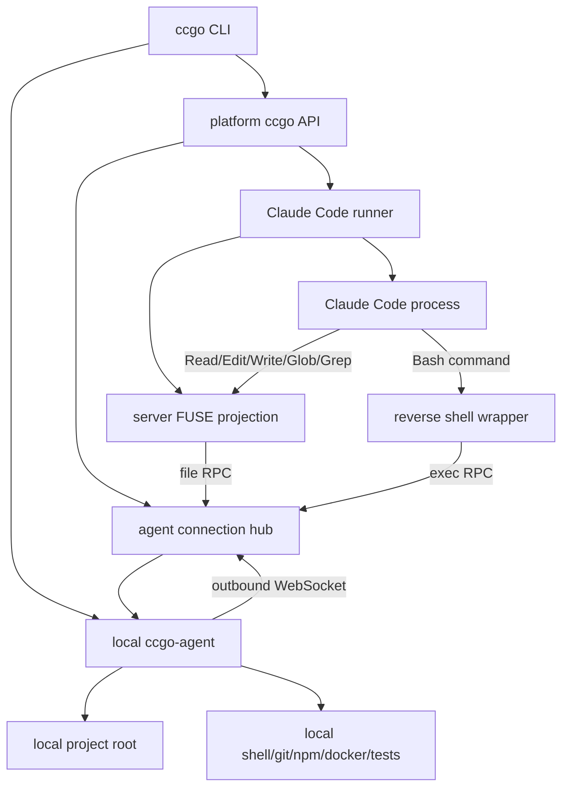
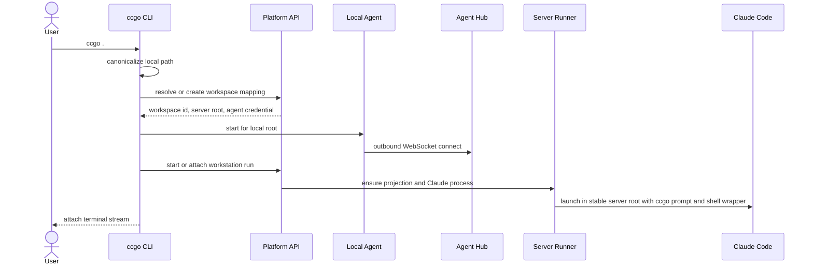
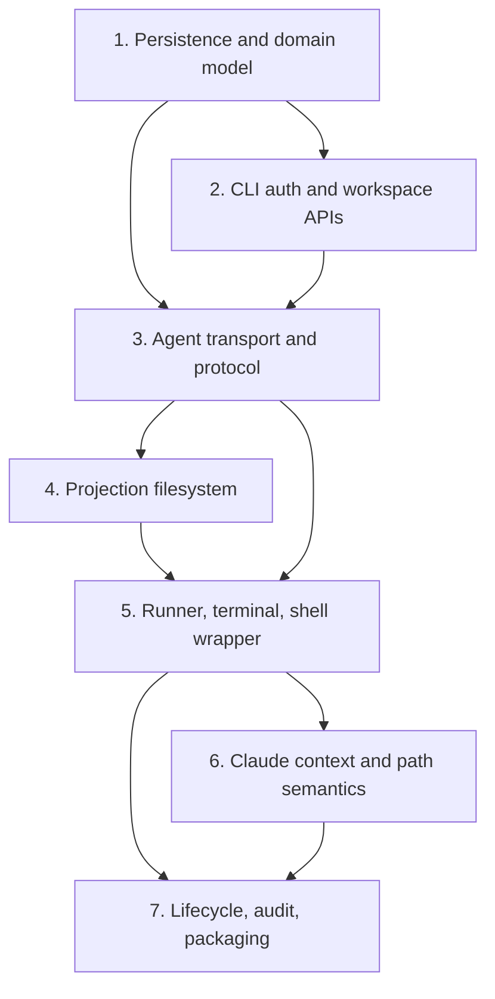

# Plan: ccgo Reverse Workstation MVP

## Overview

`ccgo` gives users a one-command way to use Claude Code from the platform while keeping the project and developer toolchain on the user's machine. The product promise is:

| Layer | Runs on the platform server | Runs on the user's machine |
|---|---|---|
| Claude Code process and TUI | Yes | No |
| Stable Claude working directory | Yes, as an internal projection root | No |
| Project file authority | No | Yes |
| Bash/git/npm/docker/test execution | No | Yes |
| User setup burden | `ccgo login`, then `ccgo .` | No system sshd, manual SSH, or manual mount setup |

The MVP should therefore build a reverse workstation, not a sync-only remote workspace. The server must give Claude Code a real, stable POSIX directory because Claude Code binds project context and session history to the current directory. That server directory is an internal projection of one canonical local project root, backed by a local `ccgo-agent` over an outbound authenticated WebSocket. Commands are intercepted with a server-side shell wrapper and executed by the local agent in the canonical local root.

## Problem Frame

The origin document is `docs/brainstorms/2026-05-09-ccgo-reverse-claude-workstation-requirements.md`.

The user wants a productized tool named `ccgo`, not a manual SSH recipe. Users authenticate to the platform, run `ccgo <local_path>`, and get an interactive Claude Code workstation whose main process is centrally managed on the server. The hard constraint is semantic: the local project root is the product truth. The server workspace root only exists because Claude Code needs a concrete working directory.

The key conceptual correction from the brainstorm is that this is not a per-run `sessions/sess_123` directory. Claude Code's own sessions are associated with project directories. A `ccgo` workstation may have short-lived process runs, but the workspace mapping must be stable: one user plus one canonical local project root maps to one stable server workspace root.

## Requirements Trace

| ID | Requirement | Plan coverage |
|---|---|---|
| R1 | `ccgo login` supports web login flow or `ccgo login <token>` | Unit 2 adds token login, device-code login, and local config storage |
| R2 | `ccgo <local_path>` starts or resumes without manual SSH/mount/Claude commands | Units 2, 5, and 7 own workspace start/resume, runner, terminal attach, and lifecycle |
| R3 | `ccgo .` resolves to a canonical local project path | Unit 2 implements path canonicalization in the CLI and records the normalized path fingerprint |
| R4 | CLI has `status` and `stop` | Unit 7 implements status/stop API and CLI behavior |
| R5 | MVP must not require system `sshd` | Unit 3 uses a bundled local agent over outbound WebSocket, not SSH |
| R6 | Local agent connects outbound to the platform | Unit 3 defines the authenticated agent WebSocket |
| R7 | Agent exposes only the selected project root and command execution for that workstation | Units 3 and 4 enforce per-workspace root confinement and path escape checks |
| R8 | Agent disconnect causes explicit file/command failure | Units 3, 4, 5, and 7 surface agent-offline errors with no server-local fallback |
| R9 | Mapping is one user, one canonical local root, one stable server root | Unit 1 models `ccgo_workspace` with uniqueness on user plus canonical local root fingerprint |
| R10 | Repeated launch reuses same server root | Units 1 and 2 make workspace resolution deterministic |
| R11 | Server root is not generated per run or named as a temporary session directory | Unit 1 stores stable workspace roots under a workspace namespace, while Unit 5 stores process runs separately |
| R12 | Local root and server root are one-to-one for a user | Unit 1 adds uniqueness constraints and conflict handling |
| R13 | Moved/renamed local project may become a new workspace by default | Unit 2 treats changed canonical roots as new mappings unless later rebinding is built |
| R14 | Local project root is canonical; server root is only a launch projection | Units 4 and 6 encode this in file projection and Claude context |
| R15 | Read/Edit/Write/Glob/Grep operate under server root with local-authoritative content | Unit 4 implements the server-side projection filesystem backed by local agent file RPC |
| R16 | Preserve project-relative path and edit semantics | Units 4 and 6 steer tool use to relative paths and preserve normal file behavior |
| R17 | No file access outside mapped local root | Units 3 and 4 enforce path normalization, symlink policy, and root confinement |
| R18 | File failures surface real errors, no placeholder/fake success | Units 3, 4, and 7 define explicit errors and observability |
| R19 | Shell commands are intercepted and executed locally | Unit 5 implements the shell wrapper and exec RPC |
| R20 | Commands translate cwd from server root to local root | Units 3 and 5 own cwd and path mapping |
| R21 | Bash/git/npm/docker/tests use local environment | Unit 5 executes commands through the local agent |
| R22 | stdout/stderr/exit code return faithfully | Units 3 and 5 define streaming exec responses and exit propagation |
| R23 | Wrapper never silently executes on server when agent unavailable | Unit 5 fails closed when the agent is disconnected |
| R24 | Interactive TTY commands may be unsupported but must be explicit | Unit 5 defines non-interactive command support and explicit TTY limitations |
| R25 | Inject session-level instructions about server root vs local root | Unit 6 injects a generated append-system-prompt file |
| R26 | Instructions prefer relative paths and local path in user-facing answers | Unit 6 owns wording and regression checks |
| R27 | Do not overwrite repository `CLAUDE.md`; preserve project instructions | Unit 6 uses startup prompt injection outside the workspace and preserves projected project files |
| R28 | Tool results make local-workstation illusion consistent | Units 5 and 6 map cwd/paths in command requests and outputs where ccgo controls them |
| R29 | Local path is product truth when both paths appear | Unit 6 makes this a runner invariant and documentation rule |
| R30 | Local absolute paths inside the project resolve where possible; otherwise steer to relative paths | Units 3, 5, and 6 handle mapping and prompt guidance |
| R31 | Credentials are sensitive and not logged in project files or command logs | Units 1, 2, 3, and 7 hash/encrypt credentials and redact logs |
| R32 | Agent connection authorized per user and workspace mapping | Units 1 and 3 bind agent credentials to workspace/user |
| R33 | Server cannot request arbitrary filesystem access outside root | Units 3 and 4 enforce local-agent authorization and path confinement |
| R34 | Command execution has auditable metadata without secret logs | Units 1 and 7 record redacted command/cwd/time/exit metadata with output redaction boundaries |
| R35 | Future dangerous-command approval remains possible | Units 3 and 5 design the exec protocol with policy hooks before execution |
| R36 | Start attaches to existing active workstation or starts one | Units 2, 5, and 7 implement run discovery and attach |
| R37 | User should not need to know server workspace path | Unit 6 and CLI output keep server paths internal |
| R38 | Errors distinguish auth, connectivity, mapping, and command failures | Units 2, 3, 4, 5, and 7 define typed errors |
| R39 | Prioritize macOS/Linux; decide Windows path | Units 2, 3, 5, and 6 model path style and define first Windows support through WSL/Git Bash preflight, with native PowerShell deferred |

## Scope Boundaries

In scope:

- A Go-based `ccgo` CLI and local agent shipped from this repository's backend Go module.
- Platform APIs for login/device authorization, workspace resolution, agent connection, start/resume, status, and stop.
- Stable workspace mapping from canonical local root to stable server projection root.
- Server-side projection filesystem backed by local agent file RPC.
- Server-side Claude Code runner with PTY streaming to the local CLI.
- Reverse shell wrapper using Claude Code startup configuration to execute shell commands through the local agent.
- Session-level Claude instructions that make the local root canonical without modifying the user's repository `CLAUDE.md`.
- Explicit error behavior and command audit metadata.

Out of scope for this MVP:

- Requiring users to enable system `sshd`, install SSHFS, or manage SSH keys.
- Sync-copy mode as a fallback when the local agent is disconnected.
- Dangerous-command approval UI, policy authoring UI, or per-command human approval.
- Full interactive TTY passthrough for commands launched by Claude's Bash tool.
- Local project rebinding after moves/renames.
- A rich browser dashboard for all workstations beyond login/device approval and basic status.

### Deferred to Separate Tasks

- Native Windows PowerShell tool semantics: the MVP protocol records Windows paths and can read/write files through a native agent, but the first command-execution path should require WSL or Git Bash so Claude's Bash-generated POSIX commands remain coherent.
- Multi-node runner scheduling: the MVP can require the agent connection manager, projection mount, and Claude runner to be on the same worker or a sticky worker. A brokered multi-runner design can follow.
- Command approval and policy UI: the protocol should include pre-exec policy hooks, but enforcement beyond root confinement and explicit audit is deferred.

## Context & Research

### Relevant Code and Patterns

- `backend/go.mod` shows the backend is a Go 1.26.2 module with Gin, Ent, PostgreSQL, Redis, Wire, and `github.com/coder/websocket v1.8.14` already available.
- `backend/internal/server/routes/user.go`, `backend/internal/server/http.go`, and `backend/internal/server/middleware/jwt_auth.go` show authenticated user route and middleware patterns.
- `backend/internal/pkg/response/response.go` provides the standard response envelope and structured error conversion.
- `backend/ent/schema/*.go`, `backend/migrations/*.sql`, and `backend/migrations/migrations.go` define the Ent plus embedded SQL migration pattern. The next migration should follow `135_add_resource_supply_credit.sql`, so the plan reserves `136_add_ccgo_reverse_workstations.sql`.
- `backend/internal/repository/wire.go`, `backend/internal/service/wire.go`, `backend/internal/handler/wire.go`, and `backend/internal/server/http.go` are the dependency-injection registration points.
- `backend/internal/service/openai_ws_*` demonstrates existing `coder/websocket` usage for long-lived streaming behavior.
- `backend/ent/schema/security_secret.go`, `backend/internal/repository/aes_encryptor.go`, and `backend/internal/repository/security_secret_bootstrap.go` show sensitive configuration and encryption patterns.
- No existing CLI/agent package was found. The new CLI should live under `backend/cmd/ccgo` to share the backend module and internal packages.

### Institutional Learnings

- No `docs/solutions/` directory exists in this repository, so there were no durable local solution notes to incorporate.

### External References

- Claude Code's CLI reference documents `--append-system-prompt` and `--append-system-prompt-file`, and recommends append flags when preserving built-in capabilities is desired: https://code.claude.com/docs/en/cli-usage
- Claude Code environment variables document `CLAUDE_CODE_SHELL_PREFIX` as a command prefix wrapping shell commands, hooks, and stdio MCP startup commands: https://code.claude.com/docs/en/env-vars
- Claude Code memory docs state that `CLAUDE.md` is loaded as context rather than enforced configuration, and that system-prompt-level instructions should use `--append-system-prompt`: https://code.claude.com/docs/en/memory
- Claude Code docs state sessions are tied to directories and context includes file contents, command outputs, `CLAUDE.md`, auto memory, and system instructions: https://code.claude.com/docs/en/how-claude-code-works
- `langwatch/claude-remote` is useful prior art for shell wrapping, path mapping, and preserving exit codes, but its direction is the opposite of `ccgo` and it uses SSH plus Mutagen with local fallback that this MVP explicitly avoids: https://github.com/langwatch/claude-remote
- `github.com/coder/websocket` is already in the repo and provides context-aware WebSocket APIs plus JSON helpers suitable for agent RPC: https://pkg.go.dev/github.com/coder/websocket
- `github.com/hanwen/go-fuse/v2` provides Go FUSE bindings and filesystem abstractions; using it adds server deployment prerequisites around FUSE support: https://pkg.go.dev/github.com/hanwen/go-fuse/v2

## Key Technical Decisions

| Decision | Choice | Rationale |
|---|---|---|
| User machine access | Bundle `ccgo-agent`; do not require system `sshd` | Narrows trust boundary and matches productized setup |
| Transport | Outbound authenticated WebSocket from agent to platform | Works behind NAT/firewalls and uses existing Go dependency/patterns |
| Workspace identity | Stable `ccgo_workspace`, not per-run session directories | Claude Code ties session/history to directory; stable roots preserve continuity |
| Server path shape | `$CCGO_WORKSPACE_ROOT/<user-slug>/<workspace-slug>` or equivalent stable root | Keeps server root deterministic while avoiding local path leakage in directory names |
| File layer | Server-side FUSE projection backed by agent file RPC | Claude file tools need a real directory; FUSE preserves local-authoritative semantics better than sync copies |
| No fallback behavior | Fail closed when agent/projection is unavailable | Silent server-local execution or stale sync would violate the core product promise |
| Command execution | `CLAUDE_CODE_SHELL_PREFIX` points to a ccgo shell-wrapper binary | Official Claude Code mechanism for wrapping shell commands while preserving built-in system prompt |
| Prompt/context injection | Use generated `--append-system-prompt-file` outside the workspace | Stronger than `CLAUDE.md` context, preserves project `CLAUDE.md`, and can vary per workspace |
| Claude config storage | Use a server-side `CLAUDE_CONFIG_DIR` scoped to the stable server workspace | Keeps Claude Code's own session files stable per workspace without mixing users |
| Hook/MCP exposure | Run Claude Code with a controlled server config for MVP | `CLAUDE_CODE_SHELL_PREFIX` also wraps hooks and stdio MCP startup; reducing auto-loaded server config avoids accidental local execution |
| Windows path | Store OS/path style in mapping; first command support via WSL/Git Bash preflight | File RPC can be native Windows, but Bash-generated commands need POSIX-compatible execution first |
| Auditing | Persist metadata, redacted command text, and command hash; do not store raw stdout/stderr by default | Satisfies auditability without turning logs into secret sinks; raw command capture must be an explicit server setting if ever added |

## Open Questions

### Resolved During Planning

- File layer: choose server-side FUSE projection backed by local agent RPC for MVP. Sync-copy and Mutagen-style designs are rejected as the primary path because they make stale-copy fallback too easy and weaken "files are local" semantics.
- Command interception: use `CLAUDE_CODE_SHELL_PREFIX`, not `$SHELL` alone. The wrapper must account for the fact that this also wraps hooks and stdio MCP startup commands.
- Claude instructions: use `--append-system-prompt-file` for ccgo's dynamic workspace instructions and leave user repository `CLAUDE.md` untouched.
- Authentication and transport: use platform-issued CLI tokens plus short-lived workspace agent credentials over WebSocket; do not use SSH keys for the product path.
- Path normalization: the local agent canonicalizes paths using OS-specific rules and sends a stable hash plus OS/path-style metadata; the server never invents canonical local paths on its own.
- Windows: support Windows in the data model and file protocol from the start, but require a POSIX-compatible shell environment for command execution in the MVP.

### Deferred to Implementation

- Exact FUSE cache TTLs, read chunk sizes, write flush policy, and large-directory pagination should be tuned during implementation with targeted tests and measurement.
- Exact Claude Code version pinning and runner flags should be validated against the platform's deployed Claude Code version when implementing the runner.
- Exact browser device-login UI placement can follow the existing frontend route/auth structure once implementation touches the frontend.
- Multi-runner coordination is deferred unless deployment topology requires it before MVP launch.

## Output Structure

This tree is the expected shape, not a rigid constraint. The per-unit file lists are authoritative.

```text
backend/cmd/ccgo/
backend/cmd/ccgo-wrapper/
backend/internal/ccgo/
  agent/
  cli/
  hub/
  projection/
  protocol/
  runner/
  shellwrapper/
backend/internal/handler/ccgo_handler.go
backend/internal/repository/ccgo_repo.go
backend/internal/server/routes/ccgo.go
backend/internal/service/ccgo_service.go
frontend/src/views/auth/CcgoDeviceLoginView.vue
docs/operations/ccgo.md
```

## High-Level Technical Design

> *This illustrates the intended approach and is directional guidance for review, not implementation specification. The implementing agent should treat it as context, not code to reproduce.*





## Implementation Units



- [x] **Unit 1: Persistence And Domain Model**

**Goal:** Add durable platform state for workspace mappings, device/login flow, agent credentials, active workstation runs, and command audit metadata.

**Requirements:** R8-R14, R31-R35, R36, R38

**Dependencies:** None

**Files:**
- Create: `backend/ent/schema/ccgo_workspace.go`
- Create: `backend/ent/schema/ccgo_agent_credential.go`
- Create: `backend/ent/schema/ccgo_workstation_run.go`
- Create: `backend/ent/schema/ccgo_command_audit.go`
- Create: `backend/ent/schema/ccgo_device_login.go`
- Create: `backend/migrations/136_add_ccgo_reverse_workstations.sql`
- Create: `backend/internal/repository/ccgo_repo.go`
- Create: `backend/internal/service/ccgo_service.go`
- Create: `backend/internal/service/ccgo_types.go`
- Modify: `backend/migrations/migrations.go`
- Modify: `backend/internal/repository/wire.go`
- Modify: `backend/internal/service/wire.go`
- Test: `backend/internal/repository/ccgo_repo_integration_test.go`
- Test: `backend/internal/service/ccgo_service_test.go`
- Test: `backend/internal/repository/migrations_schema_integration_test.go`

**Approach:**
- Model `ccgo_workspace` as the stable mapping: user id, canonical local root hash, redacted/display local root metadata, OS/path style, stable server root, status, and last-seen timestamps.
- Enforce one active mapping per user plus canonical local root hash. Store any device identifier as metadata and conflict detection, not as the primary mapping identity, so the product invariant remains "one local path maps to one server path".
- Model `ccgo_workstation_run` as process lifecycle only. It must not determine the Claude project directory.
- Store agent credentials as hashed/revocable records scoped to user and workspace. Do not persist raw credentials after issuance.
- Store command audit records with redacted command text, command hash, mapped cwd, actor/workspace/run identifiers, timestamps, exit code, timeout/cancel reason, and redaction metadata. Do not store raw stdout/stderr by default, and do not add raw command capture unless an explicit server-side setting is introduced.
- Use the repo's existing Ent schema, embedded migration, repository, service, and Wire patterns.

**Patterns to follow:**
- `backend/ent/schema/security_secret.go` for sensitive data conventions.
- `backend/internal/repository/aes_encryptor.go` for encryption boundaries when display local paths are considered sensitive.
- `backend/internal/repository/resource_supply_repo.go` and `backend/internal/service/resource_supply_service.go` for a recent multi-table feature pattern.
- `backend/migrations/135_add_resource_supply_credit.sql` for migration style and idempotency.

**Test scenarios:**
- Happy path: creating a workspace for a user and canonical local root returns a stable server root and stores OS/path metadata.
- Happy path: resolving the same user plus canonical local root returns the existing workspace rather than creating a new one.
- Edge case: attempting to bind the same user/local root to a different server root fails with a conflict.
- Edge case: the same user/local root hash appears from a different device id while another device owns the mapping; the API reports a device-mismatch conflict instead of silently reusing the mapping against a different machine.
- Edge case: moved/renamed local path produces a different canonical hash and a new workspace mapping.
- Error path: revoked or expired agent credential cannot authorize a connection.
- Error path: duplicate active workstation runs for the same workspace are not created when attach/reuse is requested.
- Integration: migration applies cleanly and Ent schema remains aligned with the database schema.

**Verification:**
- Workspace mapping identity is stable and independent from process runs.
- Agent credentials are one-time visible or hashed after issuance.
- Command audit records can be created without storing command output.

- [x] **Unit 2: CLI Login And Workspace APIs**

**Goal:** Implement user-facing `ccgo login`, `ccgo login <token>`, `ccgo <path>`, and platform APIs that resolve workspace mappings and issue short-lived agent credentials.

**Requirements:** R1-R4, R9-R14, R31-R32, R36-R38

**Dependencies:** Unit 1

**Files:**
- Create: `backend/cmd/ccgo/main.go`
- Create: `backend/internal/ccgo/cli/config.go`
- Create: `backend/internal/ccgo/cli/login.go`
- Create: `backend/internal/ccgo/cli/path.go`
- Create: `backend/internal/ccgo/cli/workspace.go`
- Create: `backend/internal/handler/ccgo_handler.go`
- Create: `backend/internal/server/routes/ccgo.go`
- Create: `frontend/src/views/auth/CcgoDeviceLoginView.vue`
- Modify: `backend/internal/handler/handler.go`
- Modify: `backend/internal/handler/wire.go`
- Modify: `backend/internal/server/http.go`
- Modify: `frontend/src/router/index.ts`
- Test: `backend/internal/ccgo/cli/path_test.go`
- Test: `backend/internal/ccgo/cli/config_test.go`
- Test: `backend/internal/handler/ccgo_handler_test.go`
- Test: `backend/internal/server/routes/ccgo_test.go`
- Test: `frontend/src/views/auth/__tests__/CcgoDeviceLoginView.spec.ts`

**Approach:**
- Store local CLI config under the user's home config directory, not in the project repository. Include platform URL, user identity display, refreshable CLI credential, and a generated device id.
- Implement `ccgo login <token>` as token exchange into a durable CLI credential.
- Implement `ccgo login` as a device-code flow: CLI requests a device code, opens or prints the approval URL, polls for completion, then stores the CLI credential.
- Implement `ccgo .` and `ccgo <local_path>` by resolving an absolute canonical path on the local machine, recording OS/path style, and calling the workspace API.
- Return server workspace root and short-lived agent credential from the workspace API only after JWT/CLI-token authorization.
- If the same user/local path hash is already mapped to another device id, default to an explicit conflict that explains the project appears to be registered from another machine. Rebinding or migration is deferred rather than silently switching the stable server root to a different local machine.
- Keep normal CLI output local-path oriented. Server roots may appear in debug output only when explicitly requested.

**Patterns to follow:**
- `backend/internal/server/routes/user.go` for authenticated user route grouping.
- `backend/internal/server/middleware/jwt_auth.go` and `backend/internal/pkg/response/response.go` for auth and response behavior.
- Existing frontend auth route and view conventions in `frontend/src/router/index.ts`.

**Test scenarios:**
- Happy path: `ccgo login <token>` stores a valid config and redacts the token from printed output.
- Happy path: device login completes after web approval and stores the same credential shape as token login.
- Happy path: `ccgo .` canonicalizes the current directory and calls workspace resolution with local OS/path metadata.
- Edge case: symlinked project path resolves consistently to the real canonical root.
- Edge case: Windows-style path metadata is preserved in the request without being interpreted as a server path.
- Error path: missing/expired CLI credential returns a login-specific error, not a generic workspace error.
- Error path: platform rejects workspace creation for a duplicate mapping conflict and the CLI prints an actionable message.
- Error path: platform rejects same-path/different-device reuse and the CLI distinguishes it from normal auth or connectivity failure.
- Integration: authenticated user route rejects unauthenticated workspace requests and accepts valid CLI/JWT credentials.

**Verification:**
- Users can authenticate and create/reuse workspace mappings without SSH or manual server commands.
- CLI config never lands in the selected project directory.

- [x] **Unit 3: Agent Transport, Protocol, And Local Capabilities**

**Goal:** Build the local `ccgo-agent` runtime and platform connection hub that provide file and exec capabilities for exactly one selected project root.

**Requirements:** R5-R8, R15-R24, R30-R35, R38-R39

**Dependencies:** Units 1 and 2

**Files:**
- Create: `backend/internal/ccgo/protocol/messages.go`
- Create: `backend/internal/ccgo/protocol/errors.go`
- Create: `backend/internal/ccgo/protocol/paths.go`
- Create: `backend/internal/ccgo/hub/connection_manager.go`
- Create: `backend/internal/ccgo/hub/rpc.go`
- Create: `backend/internal/ccgo/agent/agent.go`
- Create: `backend/internal/ccgo/agent/files.go`
- Create: `backend/internal/ccgo/agent/exec.go`
- Create: `backend/internal/ccgo/agent/paths.go`
- Modify: `backend/internal/service/ccgo_service.go`
- Modify: `backend/internal/handler/ccgo_handler.go`
- Test: `backend/internal/ccgo/protocol/messages_test.go`
- Test: `backend/internal/ccgo/protocol/paths_test.go`
- Test: `backend/internal/ccgo/hub/connection_manager_test.go`
- Test: `backend/internal/ccgo/agent/files_test.go`
- Test: `backend/internal/ccgo/agent/exec_test.go`

**Approach:**
- Use `github.com/coder/websocket` and its JSON helpers for a typed request/response protocol with request ids, deadlines, cancellation, and structured error codes.
- Agent connection authenticates with a short-lived workspace credential over `wss://`, binds itself to one workspace id and one canonical local root, and includes replay-resistant nonce/expiry checks before the hub accepts it.
- File RPC should include operations needed by the projection filesystem: stat, read, write, create, mkdir, readdir, rename, unlink, chmod/setattr where supported, readlink, and symlink policy.
- All local paths are resolved relative to the authorized root. The local agent rejects traversal, symlink escapes, drive-letter escapes, and platform-specific path tricks before touching the filesystem.
- Exec RPC should run commands in a mapped local cwd, stream stdout/stderr chunks, support timeout/cancel, and return the true exit code.
- Exec RPC should not forward arbitrary server environment variables into the local child process. The command runs in the user's local environment with only explicit ccgo metadata added.
- Add protocol fields for future command approval decisions, but make MVP policy explicit: the product does not include hidden deny lists beyond root/cwd confinement, credential authorization, timeout/cancel handling, and unsupported-interactive-command handling.
- Implement heartbeat/lease state so the server knows whether file and command requests can be served.

**Patterns to follow:**
- Existing `backend/internal/service/openai_ws_v2` patterns for WebSocket frame relay and long-lived connections.
- `backend/internal/pkg/response/response.go` for typed error semantics exposed through HTTP.

**Test scenarios:**
- Happy path: agent connects outbound with a valid workspace credential and is registered under the workspace id.
- Happy path: file read/write requests under the root operate on local files and return expected content/metadata.
- Happy path: exec request streams stdout/stderr and returns the child process exit code.
- Edge case: concurrent file reads and one command request are correlated by request id without response mix-ups.
- Edge case: large stdout is chunked without truncating the exit status.
- Error path: invalid credential, wrong workspace id, expired credential, and revoked credential are rejected.
- Error path: replayed or expired connection nonce is rejected even if the credential string was valid earlier.
- Error path: `../`, absolute path outside root, symlink-to-outside, and Windows drive escape attempts are denied before local access.
- Error path: disconnected agent causes pending requests to fail with `AGENT_DISCONNECTED`.
- Integration: hub records last-seen/heartbeat state used by status APIs.

**Verification:**
- Server components can ask for file/exec capabilities only through an authorized agent connection.
- No server-local fallback exists in the transport layer.

- [x] **Unit 4: Server Projection Filesystem**

**Goal:** Mount a stable server workspace root that Claude Code's file tools can use as a real directory while all authoritative file operations are served by the local agent.

**Requirements:** R8, R14-R18, R28-R30, R33, R38-R39

**Dependencies:** Unit 3

**Files:**
- Create: `backend/internal/ccgo/projection/mount.go`
- Create: `backend/internal/ccgo/projection/node.go`
- Create: `backend/internal/ccgo/projection/file.go`
- Create: `backend/internal/ccgo/projection/cache.go`
- Create: `backend/internal/ccgo/projection/errors.go`
- Modify: `backend/go.mod`
- Modify: `backend/go.sum`
- Test: `backend/internal/ccgo/projection/path_mapping_test.go`
- Test: `backend/internal/ccgo/projection/file_ops_test.go`
- Test: `backend/internal/ccgo/projection/disconnect_test.go`

**Approach:**
- Add `github.com/hanwen/go-fuse/v2` for the server-side projection. The server deployment must provide FUSE support; if it does not, workspace start fails with a clear projection error.
- Mount the projection at the stable server workspace root stored on `ccgo_workspace`.
- Implement FUSE nodes that proxy file operations to the agent through the hub. The projection layer should not read or write a server-side copy of the project.
- Keep metadata/content caching conservative and explicit. Short-lived caches may be used for performance, but writes, renames, deletes, and disconnects must invalidate affected entries.
- Treat writes, truncates, renames, and temp-file edit patterns as first-class behaviors because Claude edits often rely on normal editor-style file semantics. Partial-write and failed-flush errors must propagate instead of being hidden.
- If the agent is disconnected, return real filesystem errors that Claude Code can surface, and mark the workspace unhealthy.
- Protect the server root from containing ccgo-generated instruction files unless they are outside the projected tree. The projected root should represent the user project.

**Patterns to follow:**
- `backend/internal/ccgo/protocol/paths.go` from Unit 3 for path translation.
- Go-FUSE examples and `fs` abstractions for node/path filesystem structure.

**Test scenarios:**
- Happy path: reading a file through the mounted server root returns bytes from the local project.
- Happy path: writing/editing through the mounted server root changes the local file content.
- Happy path: readdir supports Claude file discovery for normal project-relative paths.
- Edge case: hidden files, nested directories, empty files, binary files, and file names with spaces preserve content and metadata.
- Edge case: temp-file write plus rename, truncate plus write, chmod where supported, and failed flush behave like normal local filesystem operations or fail explicitly.
- Edge case: local absolute paths inside the mapped project can be converted to server-relative paths where the projection API controls the request.
- Error path: local agent disconnect during read/write returns an explicit filesystem error and does not create a server placeholder.
- Error path: attempts to access outside the mapped project are denied even through symlinks.
- Integration: a real process listing and reading files under the mounted root observes local-authoritative content.

**Verification:**
- Claude Code can start in a stable directory that behaves like a project tree.
- No project data is silently materialized as an authoritative server copy.

- [x] **Unit 5: Claude Runner, Terminal Attach, And Shell Wrapper**

**Goal:** Start Claude Code on the server in the stable workspace projection, attach the local CLI to its terminal, and route Claude-initiated shell commands back to the local agent.

**Requirements:** R2, R19-R24, R28-R30, R36-R38

**Dependencies:** Units 3 and 4

**Files:**
- Create: `backend/cmd/ccgo-wrapper/main.go`
- Create: `backend/internal/ccgo/runner/runner.go`
- Create: `backend/internal/ccgo/runner/pty.go`
- Create: `backend/internal/ccgo/runner/terminal_stream.go`
- Create: `backend/internal/ccgo/runner/process_store.go`
- Create: `backend/internal/ccgo/shellwrapper/wrapper.go`
- Create: `backend/internal/ccgo/shellwrapper/path_mapper.go`
- Modify: `backend/cmd/ccgo/main.go`
- Modify: `backend/internal/ccgo/cli/workspace.go`
- Modify: `backend/go.mod`
- Modify: `backend/go.sum`
- Test: `backend/internal/ccgo/runner/runner_test.go`
- Test: `backend/internal/ccgo/runner/terminal_stream_test.go`
- Test: `backend/internal/ccgo/shellwrapper/wrapper_test.go`
- Test: `backend/internal/ccgo/shellwrapper/path_mapper_test.go`

**Approach:**
- Start Claude Code in a server PTY so the local CLI can provide an interactive terminal experience without manual SSH.
- Use a server-side runner to ensure the projection mount exists before launching Claude.
- Launch Claude with a controlled `CLAUDE_CONFIG_DIR`, `CLAUDE_CODE_SHELL_PREFIX`, ccgo workspace environment variables, and the prompt file from Unit 6.
- The shell wrapper reads the current server cwd, maps it to the canonical local cwd, rewrites server-root path references in the command to local paths, and sends an exec RPC through the hub.
- The wrapper returns stdout/stderr and the true exit code to Claude Code. It must fail closed if the agent is unavailable.
- MVP shell execution is non-interactive. Commands that require a full TTY should fail with a clear unsupported-interactive-command message unless the implementation explicitly adds local PTY support.
- Because `CLAUDE_CODE_SHELL_PREFIX` can also wrap hooks and stdio MCP startup commands, the runner should use an isolated Claude config and avoid loading arbitrary server-user hooks/MCP config in MVP.

**Patterns to follow:**
- `backend/internal/service/openai_ws_v2` for stream lifecycle ideas.
- Existing handler/service error propagation conventions.
- `langwatch/claude-remote` only as prior art for shell wrapping and path mapping, not for fallback or SSH assumptions.

**Test scenarios:**
- Happy path: starting a run launches Claude under the stable server workspace root and attaches terminal bytes to the CLI.
- Happy path: wrapper maps server cwd to local cwd and executes `pwd` locally, returning local-path output.
- Happy path: wrapper preserves stdout, stderr, and non-zero exit code from a local command.
- Edge case: command includes quoted server-root paths and maps only path occurrences that are inside the workspace.
- Edge case: long-running command streams output and can be cancelled by timeout or user stop.
- Error path: agent disconnected before command start returns a wrapper failure and does not run the command on the server.
- Error path: unsupported interactive command reports a clear limitation.
- Integration: Claude run state persists as a workstation run record while the workspace root remains stable.

**Verification:**
- A user can run `ccgo .` and interact with a server-hosted Claude Code process from the local terminal.
- Local shell/git/npm/docker/test commands execute on the local machine or fail explicitly.

- [x] **Unit 6: Claude Context And Path Semantics**

**Goal:** Make Claude Code understand that the local project root is canonical, the server workspace root is internal, and relative paths are preferred, without modifying the user's project instructions.

**Requirements:** R14, R25-R30, R37-R39

**Dependencies:** Unit 5

**Files:**
- Create: `backend/internal/ccgo/runner/prompt.go`
- Create: `backend/internal/ccgo/runner/prompt_templates.go`
- Create: `backend/internal/ccgo/runner/path_semantics.go`
- Test: `backend/internal/ccgo/runner/prompt_test.go`
- Test: `backend/internal/ccgo/runner/path_semantics_test.go`
- Modify: `backend/internal/ccgo/runner/runner.go`
- Create: `docs/operations/ccgo.md`

**Approach:**
- Generate a per-workspace prompt file outside the projected workspace and launch Claude with `--append-system-prompt-file`.
- Include concise instructions that:
  - The canonical workspace is the user's local path.
  - The server workspace root is an internal ccgo projection needed only to run Claude Code.
  - File tool calls should use project-relative paths whenever possible.
  - User-facing explanations should refer to relative paths or the local root, not the server projection root.
  - Shell commands execute on the user's local machine through ccgo.
  - If a local absolute path cannot be used directly with Claude file tools, convert to a relative path inside the project.
- Preserve the user's projected `CLAUDE.md`, `.claude/CLAUDE.md`, and `CLAUDE.local.md` exactly as local files. Do not write a generated ccgo `CLAUDE.md` into the repository.
- Optionally set privacy-oriented environment variables such as hiding the cwd in terminal UI where available, but do not rely on them as the semantic control.
- Add tests around prompt content so future edits do not reintroduce server-root-as-truth language.

**Patterns to follow:**
- Claude Code CLI docs for append system prompt behavior.
- Claude Code memory docs explaining that `CLAUDE.md` is advisory context, not enforced configuration.

**Test scenarios:**
- Happy path: generated prompt includes local root, server root, relative-path guidance, and local command-execution guidance.
- Happy path: prompt file is outside the mounted project tree and never written to the local repository.
- Edge case: Windows local root appears as canonical display text while tool guidance still instructs relative file paths.
- Edge case: local path containing spaces is rendered safely in prompt text.
- Error path: missing local root or server root metadata prevents Claude launch rather than generating ambiguous instructions.
- Integration: runner passes the prompt file flag while preserving normal project `CLAUDE.md` loading through the projection.

**Verification:**
- Claude receives stronger session-level path guidance without changing project files.
- The plan's path semantics match the product truth: local root canonical, server root internal.

- [x] **Unit 7: Lifecycle, Audit, Packaging, And Operations**

**Goal:** Complete the MVP lifecycle with `status`, `stop`, health checks, command audit metadata, explicit errors, packaging, and deployment documentation.

**Requirements:** R2, R4, R8, R23-R24, R31-R38

**Dependencies:** Units 1-6

**Files:**
- Create: `backend/internal/ccgo/runner/health.go`
- Create: `backend/internal/ccgo/runner/cleanup.go`
- Create: `backend/internal/ccgo/cli/status.go`
- Create: `backend/internal/ccgo/cli/stop.go`
- Modify: `docs/operations/ccgo.md`
- Modify: `backend/internal/repository/ccgo_repo.go`
- Modify: `backend/internal/service/ccgo_service.go`
- Modify: `backend/internal/handler/ccgo_handler.go`
- Modify: `backend/internal/ccgo/shellwrapper/wrapper.go`
- Test: `backend/internal/ccgo/cli/status_test.go`
- Test: `backend/internal/ccgo/cli/stop_test.go`
- Test: `backend/internal/ccgo/runner/health_test.go`
- Test: `backend/internal/ccgo/runner/cleanup_test.go`
- Test: `backend/internal/service/ccgo_service_lifecycle_test.go`

**Approach:**
- `ccgo status` should distinguish login state, workspace mapping state, local agent state, projection mount state, Claude run state, and last command failure.
- `ccgo stop` should stop the local agent connection for the selected workspace and request server-side runner cleanup. It should not delete the stable workspace mapping by default.
- Add health checks for agent heartbeat, projection mount availability, runner process liveness, and terminal stream attachment.
- Persist command audit metadata on every shell wrapper request, including failures before execution. Store redacted command text and command hashes, not raw stdout/stderr, and make any future raw-command capture an explicit opt-in setting with retention documentation.
- Redact tokens, environment values, and output content from normal logs. If debug logging is added, it must be explicit and easy to disable.
- Document server deployment prerequisites: Claude Code installed/authenticated in the managed environment, FUSE available on runner hosts, workspace root base directory, wrapper binary path, PTY support, and sticky runner assumption for MVP.

**Patterns to follow:**
- `backend/internal/pkg/response/response.go` for typed user-facing error metadata.
- Existing ops/service patterns in `backend/internal/repository/ops_repo.go` and `backend/internal/service/ops_service.go` for status-style reporting.

**Test scenarios:**
- Happy path: `status` reports logged in, agent connected, projection mounted, and run attached.
- Happy path: `stop` terminates the workstation run and unmounts/cleans projection state while preserving the workspace mapping.
- Edge case: `status` for a known workspace with no active run reports resumable mapping rather than failure.
- Error path: agent disconnected, projection unavailable, command failed, and auth expired are distinguishable in CLI output and API reason codes.
- Error path: cleanup failure surfaces a real error and leaves enough state for a later cleanup retry.
- Integration: command audit records are written for successful, failed, timed-out, and not-executed-because-agent-offline commands.

**Verification:**
- The user can understand and control the workstation lifecycle without knowing server paths.
- Operators have enough health and audit metadata to diagnose failures without reading project files or command outputs.

## System-Wide Impact

- **Interaction graph:** New authenticated user APIs, one WebSocket agent endpoint, a long-lived in-memory connection hub, server-side FUSE mounts, server PTY processes, local CLI config, and frontend device-login approval all interact. This work should stay isolated under `ccgo` route/service/package names to avoid touching the gateway hot path.
- **Error propagation:** Errors must remain typed from local agent to hub to projection/wrapper to Claude/CLI/API. The most important invariant is no silent fallback: agent unavailable, FUSE unavailable, command timeout, and auth failure must all surface distinctly.
- **State lifecycle risks:** Workspace mappings are stable; workstation runs are disposable. Stale runs, disconnected agents, orphaned mounts, and orphaned PTYs need cleanup that does not delete the stable mapping.
- **API surface parity:** CLI commands and HTTP APIs need matching lifecycle semantics. If `ccgo status` can report a state, the backend should expose the same state in a structured form.
- **Privilege boundary:** Local CLI/agent binaries should run from the user's normal account and should not require elevated privileges. Server FUSE privileges belong only to runner hosts.
- **Integration coverage:** Unit tests alone will not prove the MVP. The implementation needs at least one end-to-end local harness that starts an agent, mounts a projection, performs a file edit through the server root, executes a shell command through the wrapper, and verifies local effects.
- **Unchanged invariants:** Existing Sub2API gateway request routing, billing, settlement-pool, and model-provider behavior should not change. `ccgo` is a new workstation product surface, not a change to existing AI API proxy behavior.

## Alternative Approaches Considered

| Approach | Why not primary MVP |
|---|---|
| System `sshd` plus reverse SSHFS | Simple prototype, but violates the productized no-sshd requirement and broadens machine-level trust |
| Mutagen or rsync-style bidirectional sync | Faster for large repos, but creates server copies and stale/fallback semantics that conflict with local-authoritative files |
| MCP-only filesystem tools | Would not cover Claude Code's built-in Read/Edit/Write/Glob/Grep tools unless Claude is forced away from built-ins |
| `$SHELL` replacement only | Useful prior art, but Claude Code now documents `CLAUDE_CODE_SHELL_PREFIX`, which is the more explicit command-wrapping surface |
| Per-run temporary server directories | Fragments Claude Code project context and contradicts the stable mapping requirement |

## Success Metrics

- A fresh user can run `ccgo login` and `ccgo .` without enabling system SSH or manually mounting anything.
- Re-running `ccgo .` from the same canonical local path reuses the same stable server workspace root.
- Editing a file through Claude Code changes the local project file and creates no authoritative server copy.
- Running `pwd`, `git status`, package manager commands, Docker commands, and tests executes on the local machine and returns real stdout/stderr/exit code.
- Disconnecting the agent causes file and command requests to fail visibly.
- Normal user-facing output refers to project-relative paths or the local root, not the server projection root.
- `ccgo status` and `ccgo stop` work without exposing implementation paths.

## Dependencies / Prerequisites

- Server runner hosts must have Claude Code installed and authenticated through the platform's managed account strategy.
- Server runner hosts must support FUSE for the projection filesystem. Containerized deployments may need `/dev/fuse` and the required capabilities configured explicitly.
- Server runner hosts must support PTY process management for interactive Claude Code.
- The MVP deployment should run the API/hub/projection/runner on a sticky host or a single host per active workspace until a brokered multi-runner design exists.
- Local macOS/Linux users need permissions to run the bundled `ccgo-agent` and execute their local shell/toolchain.
- Windows users need WSL or Git Bash for MVP command execution. Native Windows file access can be modeled in the protocol, but native PowerShell command semantics are deferred.

## Risk Analysis & Mitigation

| Risk | Likelihood | Impact | Mitigation |
|---|---:|---:|---|
| FUSE is unavailable or hard to run in production containers | Medium | High | Make FUSE a documented runner prerequisite; fail workspace start explicitly; do not fallback to sync silently |
| FUSE over WebSocket is slow on large repos | Medium | Medium | Add conservative caching, measure large-directory behavior, keep performance tuning explicit, and consider sync acceleration only as a later opt-in mode |
| Agent disconnect during write corrupts user files | Medium | High | Use write/flush semantics carefully, propagate partial-write errors, and add integration tests for disconnect during write |
| Claude still mentions server root from built-in context | Medium | Medium | Use append-system-prompt, relative path guidance, stable path mapping, and output rewriting where ccgo controls output |
| `CLAUDE_CODE_SHELL_PREFIX` wraps hooks/MCP stdio startup unexpectedly | Medium | High | Use isolated `CLAUDE_CONFIG_DIR` and controlled server config for MVP; document this behavior and test wrapper classification |
| Command execution leaks secrets into logs | Medium | High | Audit metadata only by default; redact command logs; never store stdout/stderr unless explicit debug mode is enabled |
| Same user has same local path on different devices | Low | Medium | Detect device mismatch and report a rebind/conflict flow; do not silently point one server root at a different machine |
| Agent credential replay after local compromise or log leak | Low | High | Use short-lived scoped credentials, hashed storage, nonce/expiry checks, TLS-only transport, and revocation on stop/logout |
| Windows path semantics confuse Claude file tools | Medium | Medium | Use relative paths as primary guidance; require WSL/Git Bash for MVP commands; keep OS/path-style metadata for future native support |
| Orphaned runner, mount, or PTY after crash | Medium | Medium | Add lifecycle health checks and cleanup worker keyed by workstation run records |
| Claude Code CLI behavior changes across versions | Medium | Medium | Pin or record supported Claude Code versions in ops docs and include startup smoke tests around prompt and shell prefix behavior |

## Phased Delivery

### Phase 1: Control Plane And Local Agent Skeleton

- Land Units 1-3 with token login, device login, workspace resolution, authenticated agent WebSocket, and simple file/exec RPC tests.
- Prove no system sshd is required.

### Phase 2: Local-Authoritative Files

- Land Unit 4 with FUSE projection and local file operation integration tests.
- Acceptance gate: a process reading/writing the server root changes local files and fails when the agent disconnects.

### Phase 3: Claude Runner And Command Execution

- Land Units 5-6 with PTY attach, shell wrapper, command execution RPC, and append-system-prompt injection.
- Acceptance gate: Claude Code can run from the server root while commands execute locally.

### Phase 4: Product MVP Hardening

- Land Unit 7 with status/stop, health, audit, packaging, and operational documentation.
- Acceptance gate: a user can recover from auth, disconnect, projection, and command failures with clear messages.

### Phase 5: Windows And Policy Expansion

- Add native Windows command execution or PowerShell-specific semantics if product demand requires it.
- Add dangerous-command approval and richer policy controls on top of the protocol hooks.

## Documentation / Operational Notes

- Add `docs/operations/ccgo.md` with:
  - user commands: login, run, status, stop
  - server prerequisites: Claude Code, FUSE, PTY, stable workspace base path, wrapper path
  - local prerequisites by OS
  - failure modes and error-code meanings
  - security model: local root confinement, outbound-only agent, no sshd, no silent fallback
- Document that `CLAUDE.md` in the user's repository is preserved and projected as-is. ccgo's own path semantics are injected with a generated append-system-prompt file outside the project.
- Document that server workspace paths are implementation details and should not appear in normal support copy unless debugging projection issues.

## Sources & References

- Origin document: `docs/brainstorms/2026-05-09-ccgo-reverse-claude-workstation-requirements.md`
- Existing route pattern: `backend/internal/server/routes/user.go`
- Existing auth middleware: `backend/internal/server/middleware/jwt_auth.go`
- Existing response envelope: `backend/internal/pkg/response/response.go`
- Existing Wire registration: `backend/internal/repository/wire.go`, `backend/internal/service/wire.go`, `backend/internal/handler/wire.go`, `backend/internal/server/http.go`
- Existing migration pattern: `backend/migrations/135_add_resource_supply_credit.sql`, `backend/migrations/migrations.go`
- Claude Code CLI reference: https://code.claude.com/docs/en/cli-usage
- Claude Code environment variables: https://code.claude.com/docs/en/env-vars
- Claude Code memory docs: https://code.claude.com/docs/en/memory
- Claude Code architecture/session docs: https://code.claude.com/docs/en/how-claude-code-works
- langwatch prior art: https://github.com/langwatch/claude-remote
- coder/websocket package docs: https://pkg.go.dev/github.com/coder/websocket
- go-fuse package docs: https://pkg.go.dev/github.com/hanwen/go-fuse/v2
